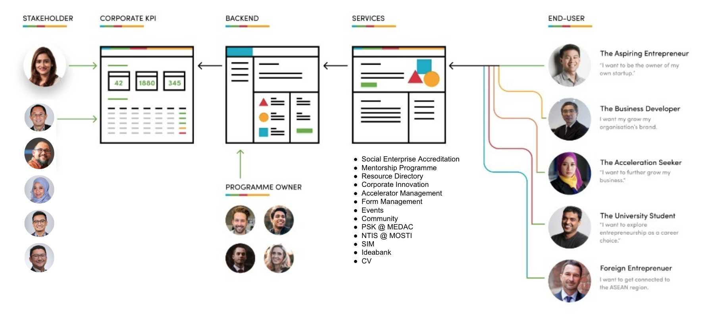
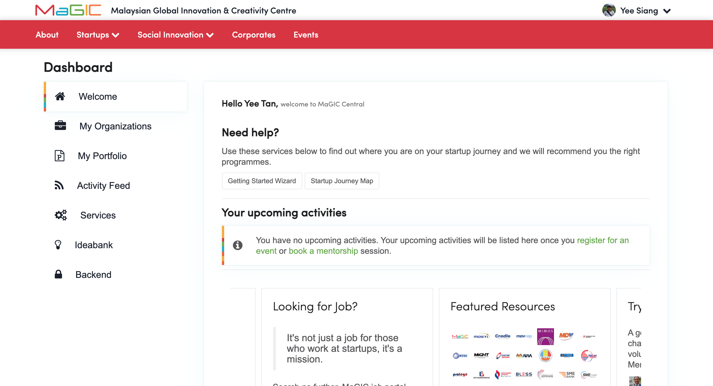

# What is Central

Central is a one-stop **startup ecosystem management tool.** 

It has been empowering [MaGIC](https://mymagic.my) since 2016 connecting ecosystem partners & entrepreneurs through integrated, convenient and quality digital services.

### With Central you can:

* **Remove Information Silo** with Central acting as a Single Source Of Truth \(SSOT\) for data

* **Overcome Management Challenge** where KPI is now detailed up to atomic level
* **Streamline UX Experience -** no more duplicate user profiles in different systems.

* **Enforce Integration** with systems built by different vendors using the same data standard and stack of technologies.
* **Reduce Redundant Effort** by building together thru Open Source and Open Data 

