# Campus ID for Admin

### Manage Campus Members

* Login into your magic account and navigate to [backend](https://central.mymagic.my/backend/).
* To manage campus members navigate to `Service -> Campus -> Manage Campus Members`

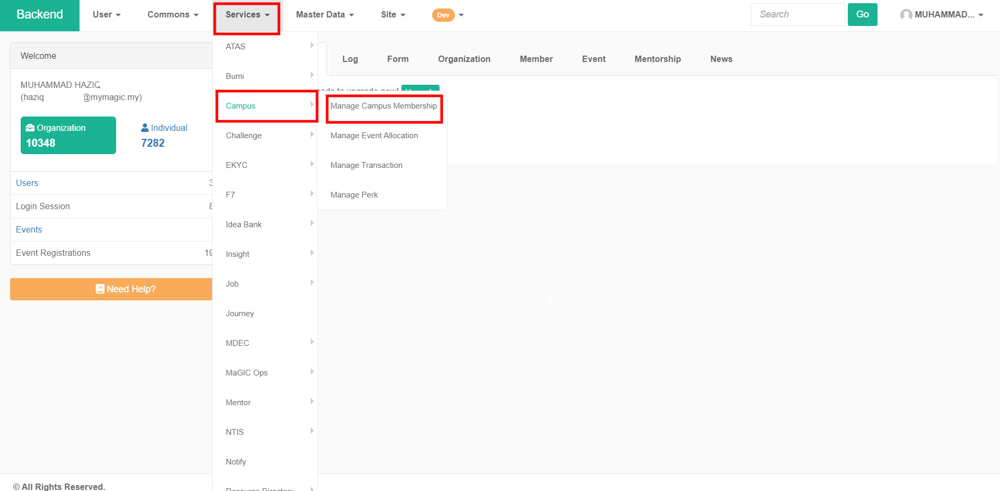

* In the "Manage Campus Membership" page, you can see a table that lists accounts that has successfully been registered for Campus ID.
* Column Description : 
  * **Code** - Displays the Campus ID membership ID number.
  * **Identifier -** For individual membership, the value should be the person's IC number while organization should be the organization's SSM registration number.
  * **Title -** The name of the registered person / Name of the organization.
  * **Perks Provider** - Green circle shows the member are one of the perks providers for Campus ID.
  * **Quest Providers** - Green circle shows the member are one of the quest providers for Campus ID
  * **Status** - Shows the current status of the member.

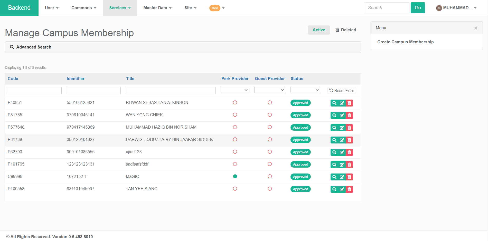

#### View Membership Details

* To view get more detailed information about each Campus ID member, click on the magnifying glass icon in the right most column.

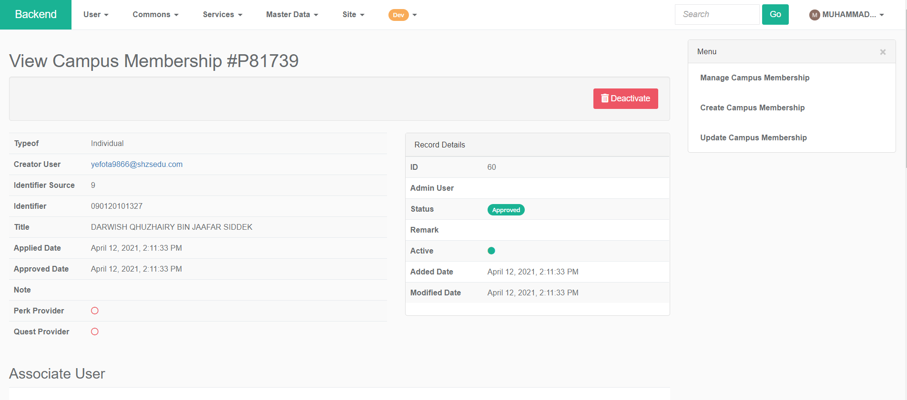

#### Update Membership

* To update each Campus ID member, click on the pen & paper icon in the right most column.
* In the "Update Campus Membership" page, a greyed out field is not editable because the field is automatically populated during the eKYC process. A non-greyed out field can be edited
* The users field will show a list of all the emails that are tied to the same person.
* Click the save button at the bottom of the page to save the changes that has been made.

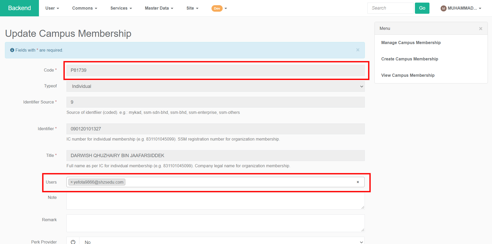

#### Deactivate Campus ID Membership

* To deactivate a Campus ID member, click on the red trashcan icon in the right most column. Deactivated will be moved to the recycle bin and can be reactivated.

### Allocate points to an event

* Login into your magic account and navigate to [backend](https://central.mymagic.my/backend/).
* To manage allocate rewards to events navigate to `Service -> Campus -> Manage Event Allocation`

#### Allocate XP & RP to event

* Click on the "Create Event Allocation" link to start allocating experience \(XP\) and redeemable point \(RP\) to an event.

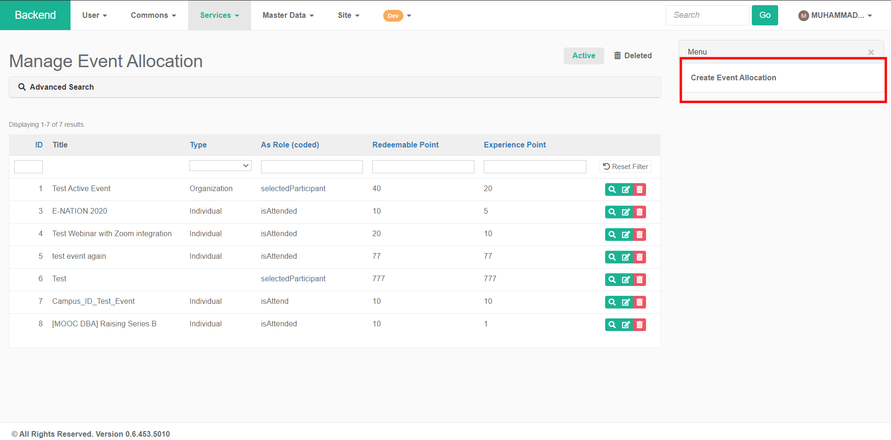

* In the "Create Event Allocation" fill all the required fields and click the "Create" button to allocate points to the event.
* Field description:
  * **Event** - A dropdown list where you can search event that has been created.
  * **Type -** Types of Campus ID membership either Individual or Organization.
  * **As Role** - selectedParticipant will grant the reward to the selected participant while isAttend will only grant the reward only when the individual attend the event.
  * **Experience Points** - The amount of experience points to give to participants. 
    * \(Ensure that this is the correct value, once the event allocation is created, updating this value will not change the amount that participants receive\)
  * **Redeemable Points** - The amount of redeemable points to give to participants. 
    * \(Ensure that this is the correct value, once the event allocation is created, updating this value will not change the amount that participants receive\)
  * **Note** - Additional notes that will be displayed to the participants.
  * **Remart** - For backend admin use only.

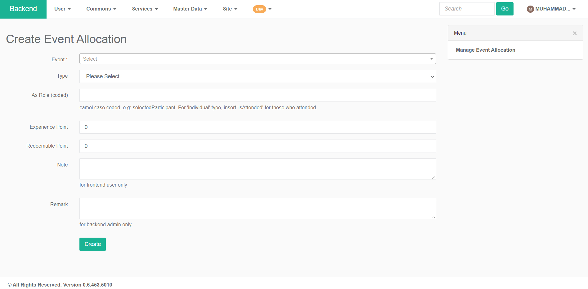

* Click the "Create" button to save the event allocation.

### Manage transactions

* Login into your magic account and navigate to [backend](https://central.mymagic.my/backend/).
* To manage transaction navigate to `Service -> Campus -> Manage Transaction`
* _Note : Transaction cannot be deleted. To add or remove XP & RP for Campus ID members, create a new transaction to add or remove XP & RP. Editing XP & RP for created transaction will not change the XP & RP that Campus ID members receive/deducted._

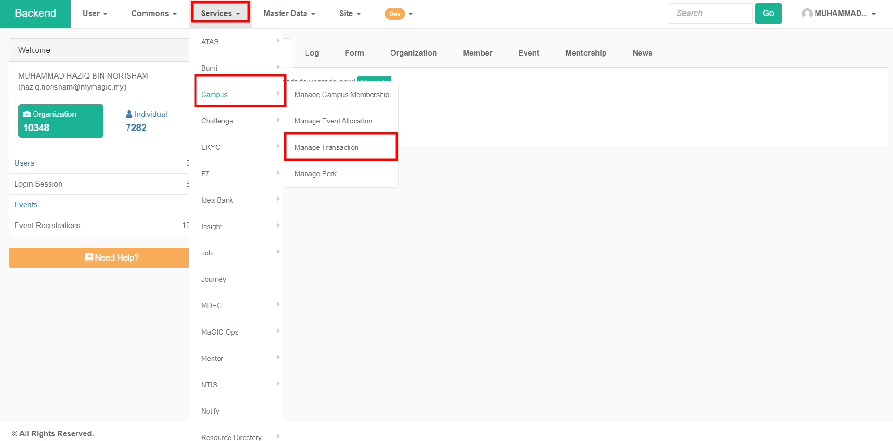

* In the "Manage Transaction Page" you can see a table that lists all the XP & RP transaction for Campus ID members.

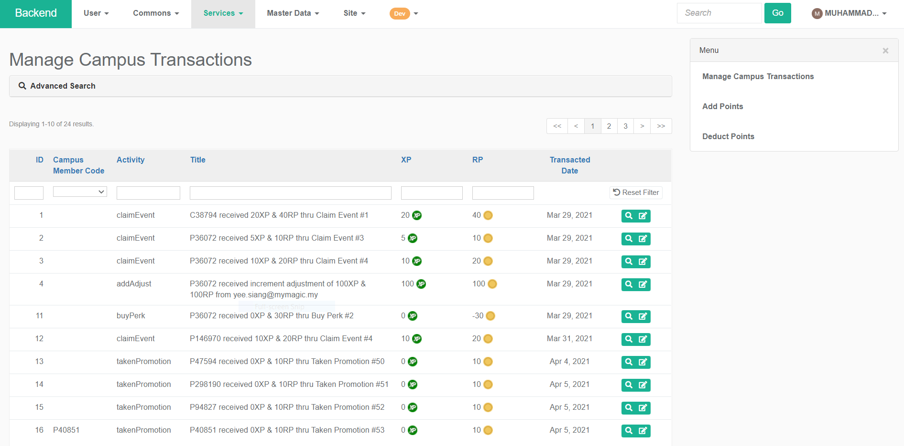

#### Manually add point to a member

* To manually add XP & RP to Campus ID members, click on the "Add Points" button on the right side of the page.

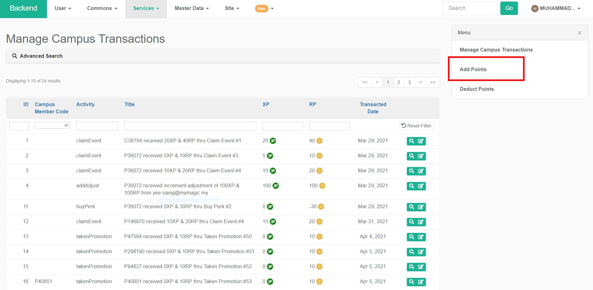

* Fill all the required field and click the "Create" button to save add points to a Campus ID member.
* Field description :
  * **Campus Member Code** - Campus ID membership Code e.g. "P1234"
  * **XP** - The amount of experience points to give to Campus ID member. 
    * \(Ensure that this is the correct value, once the transaction is created, updating this value will not change the amount that participants receive\)
  * **RP** - The amount of redeemable points to give to Campus ID member. 
    * \(Ensure that this is the correct value, once the transaction is created, updating this value will not change the amount that participants receive\)
  * **Promotion Code** - If promotion code is se, transaction will be recorded as 'TakenPromotion' activity.
  * **Note** - Additional notes that will be displayed to the participants.
  * **Remark -** For backend admin use only.

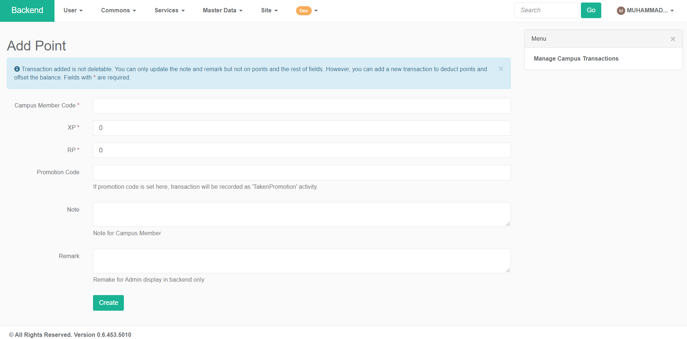

* Click the "Create" button to save the transaction and add XP & RP to the Campus ID member.

#### Manually deduct point from a member

* To manually deduct XP & RP to Campus ID members, click on the "Deduct Points" button on the right side of the page.

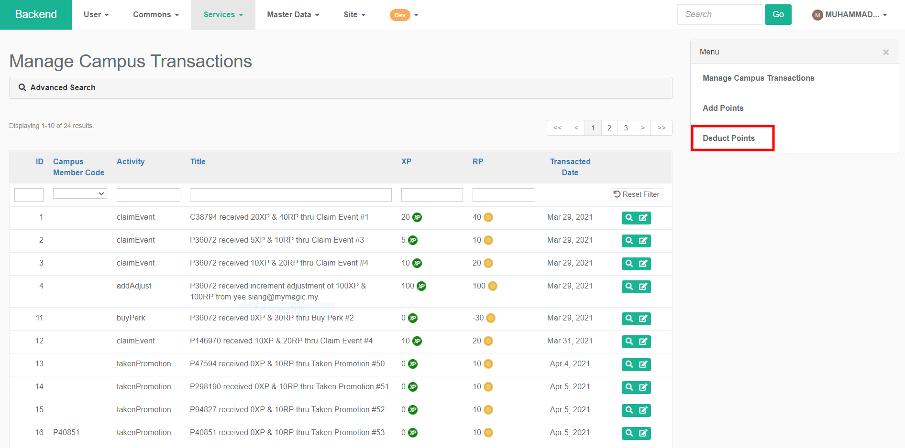

* Fill all the required field and click the "Create" button to deduct points from a Campus ID member.
* Field description :
  * **Campus Member Code** - Campus ID membership Code e.g. "P1234"
  * **XP** - The amount of experience points to remove from Campus ID member. 
    * \(Ensure that this is the correct value, once the transaction is created, updating this value will not change the amount that participants receive\)
  * **RP** - The amount of redeemable points to remove from Campus ID member. 
    * \(Ensure that this is the correct value, once the transaction is created, updating this value will not change the amount that participants receive\)
  * **Note** - Additional notes that will be displayed to the participants.
  * **Remark -** For backend admin use only.

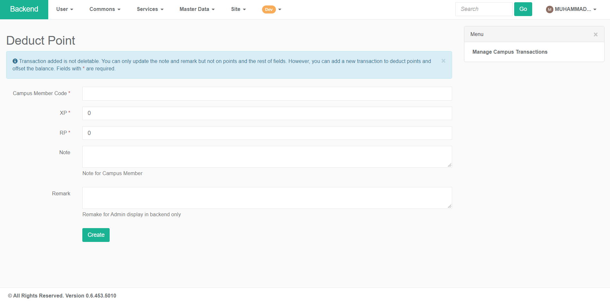

* Click the "Create" button to save the transaction and deduct XP & RP to the Campus ID member.

### Manage Perks

* Login into your magic account and navigate to [backend](https://central.mymagic.my/backend/).
* To manage perks navigate to `Service -> Campus -> Manage Perk`

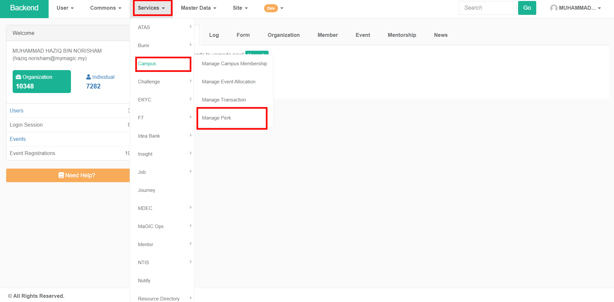

* In the "Manage Perk" page, you can see a table that list all the perks that is offered to Campus ID members.

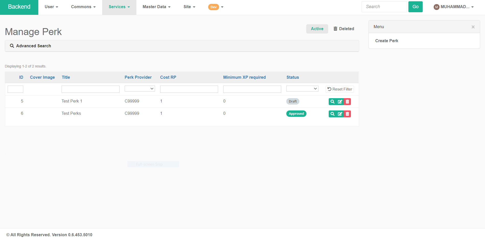

* Click on the "Create Perk" list to offer a new perk to Campus ID members.

* Fill all the required field and click the create button at the bottom of the page to create a new perk for Campus ID members.

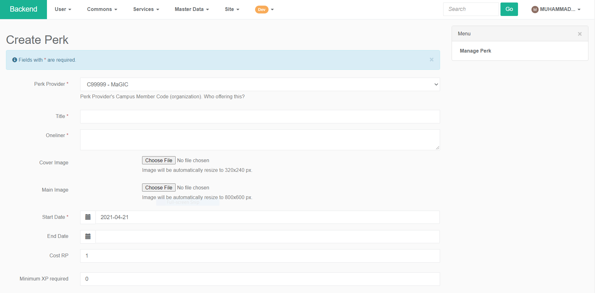

Only Campus Member of organization type \(start with prefix 'c'\) and can be marked as `is_perk_provider` can be assigned. Admin also needs to associate this perk to the correct organization behind this campus membership.

