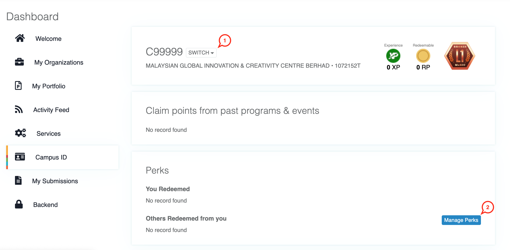
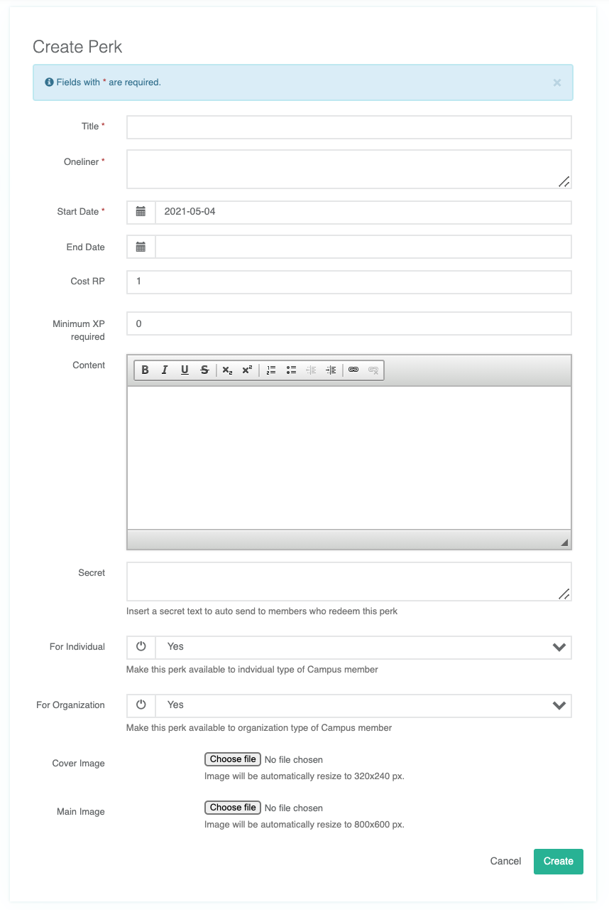
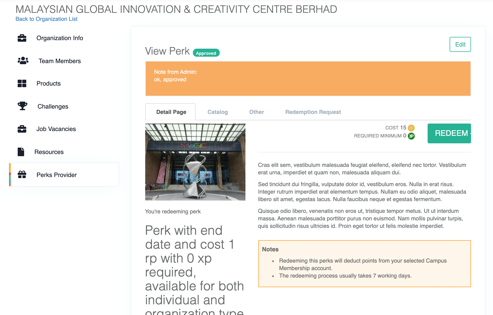
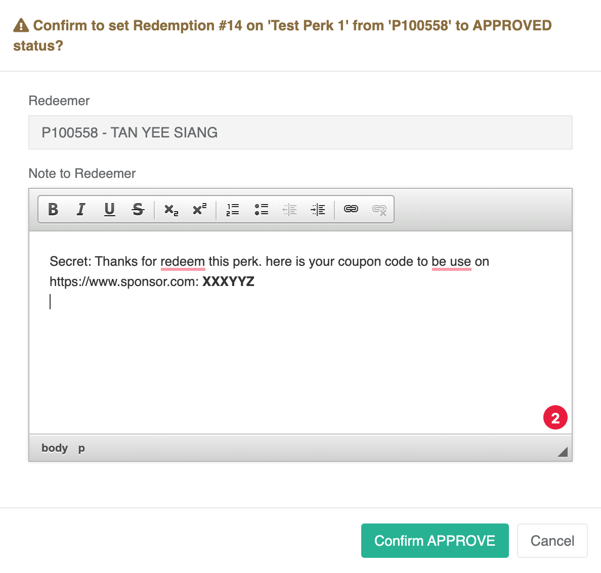

# Campus ID for Perk Provider


This feature is currently under development. Please come back later.


Perks can be created by any Organization type of Campus ID Member in Member Control Panel. Admin approval is required to publish for other Campus ID Member to redeem.

### Recommended type of perks

Our community consists of both aspiring and existing entrepreneur are constantly looking for perks that can help their startup grow. Web/Cloud hosting voucher, stock photo credit, SaaS system voucher, discount code for digital marketing services, legal templates, co-working space hotdesk and etc are just a few great examples out of many.

### Create Perk

1. Make sure you selected an organization type of Campus Member ID account. Not all 0-
2. Click `Manage Perk` button.

#### Approval Process

1. Click `Create` button to save draft. Status of this perk is Draft
2. Click `Submit` button to change the status to `Submitted` for admin approval. It takes between 1 to 3 working days for admin to process.
3. Admin may mark the status to `Processing` when amendment to the submitted details is required. Perks provider will receive email notification to re-edit and re-submit this entry.
4. When everything is good to be listed, admin will change the status to `Approved`. This perk will be automatically set to `published` and listed on perks portal. Perks provider is free to make changes to the details after posted. 
5. Don't be upset if it gets `Rejected`. Admin may think it is not suitable for our community but you can always submit a new entry. 

#### What is a Secret Message

Optional but if filled, this message will be sent to the redeemer upon your approval of his request. Don't worry, it only serves as a template and you can always change it in the approval process.

### Manage Redeem Requests

Once your perk is published, you will soon be receiving redeem requests from our startups and entrepreneurs.


Only you as the perk provider can manage the redeem requests. Our admins only have view access from backend.


### Redemption Request Workflow

<table>
  <thead>
    <tr>
      <th style="text-align:left">Status</th>
      <th style="text-align:left">Trigger By</th>
      <th style="text-align:left">Description</th>
    </tr>
  </thead>
  <tbody>
    <tr>
      <td style="text-align:left"><b>Submitted</b>
      </td>
      <td style="text-align:left">Redeemer</td>
      <td style="text-align:left">
        <ul>
          <li>RP is deducted from the Redeemer account and store temporarily at ESCROW.</li>
          <li>Redemption request is displayed on the Provider interface to process.</li>
        </ul>
      </td>
    </tr>
    <tr>
      <td style="text-align:left"><b>Processing</b>
      </td>
      <td style="text-align:left">Provider</td>
      <td style="text-align:left">
        <ul>
          <li>To mark the request is under process by the Provider.</li>
          <li>Can proceed next to either <code>Rejected</code> or <code>Approved</code>
          </li>
        </ul>
      </td>
    </tr>
    <tr>
      <td style="text-align:left"><b>Rejected</b>
      </td>
      <td style="text-align:left">Provider</td>
      <td style="text-align:left">
        <ul>
          <li>To reject the redemption request</li>
          <li>RP is returned to the Redeemer account from ESCROW</li>
          <li>Rejected request can be revert to <code>Processing</code> status. RP will
            be deducted from the Redeemer account again and store temporarily at ESCROW
            (required redeemer to have sufficient RP balance).</li>
        </ul>
      </td>
    </tr>
    <tr>
      <td style="text-align:left"><b>Approved</b>
      </td>
      <td style="text-align:left">Provider</td>
      <td style="text-align:left">
        <ul>
          <li>Provider accepted this redemption and is preparing for its delivery.</li>
          <li>Secret message will be pre set in note to redeemer and sent thru email.
            Secret message normally carries instruction on how to acquire the products
            or services, like a voucher code for example.</li>
          <li>The redeemer can proceed next to <code>Delivered</code>
          </li>
        </ul>
      </td>
    </tr>
    <tr>
      <td style="text-align:left"><b>Delivered</b>
      </td>
      <td style="text-align:left">Provider</td>
      <td style="text-align:left">
        <ul>
          <li>This marks the end of workflow on the Provider side.</li>
          <li>RP will be transferred and added to the Provider account.</li>
          <li>For physical products or services, it means the parcel had been sent to
            courier services. Delivery tracking code can be inserted in the Note to
            Redeemer.</li>
          <li>For digital products or services, instruction to acquire had been sent
            in the <code>Approved</code> stage thru secret message.</li>
          <li>This action is not revertable.</li>
        </ul>
      </td>
    </tr>
    <tr>
      <td style="text-align:left"><b>Completed</b>
      </td>
      <td style="text-align:left">Redeemer</td>
      <td style="text-align:left">
        <ul>
          <li>Triggered by redeemer after <code>Delivered</code> status is marked by Provider
            to mark the completion of the entire redemption workflow.</li>
          <li>This is optional as most Redeemers may ignore it.</li>
        </ul>
      </td>
    </tr>
  </tbody>
</table>

### Dispute

Disputes may happen between Perk Provider and Redeemer. MaGIC Campus ID operation team will help to solve the dispute. 

