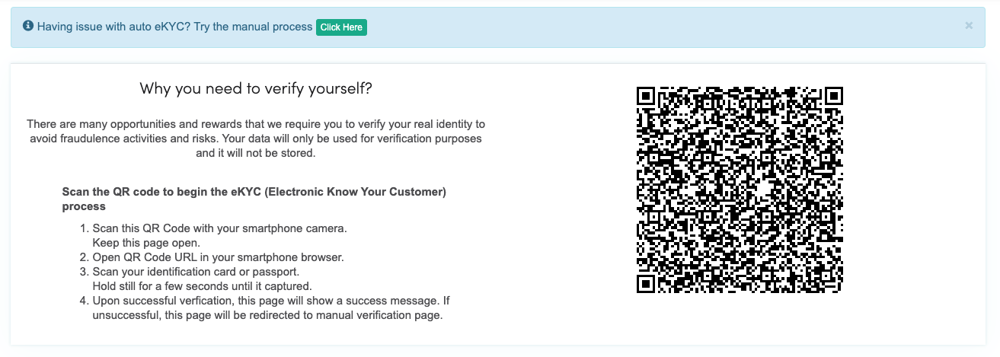

# EKYC

EKYC is a module that allows Central user to verify their real identity to a National Identification Code or Passport. It too allows organisation to be verified thru government documents \(SSM for example\).


An user / organisation have only 1 approve EKYC record at a time. 


### EKYC for User

#### Auto with BlinkID

This is the default interface for users who like to verify their identity. The steps are simply:

1. Scan this QR Code with your smartphone camera. Keep this page open.
2. Open QR Code URL in your smartphone browser.
3. Scan your identification card or passport. Hold still for a few seconds until it captured.
4. Upon successful verification, this page will show a success message. If unsuccessful, this page will be redirected to the manual verification page.

The approval process for auto verification is instant, however, please note:

* BlinkID is not perfect and best working on smartphones' high-resolution camera
* BlinkID should work with Malaysia MyKad and International Passport
* In the case where auto verification failed, a message will be shown after 30 seconds \(this value can be customized by admin\) to redirect user to the manual process

#### Manual Process

1. User to upload required scanned ID documents and input detail as per instruction
2. Admin will process accordingly. Admin may raise additional questions to user \(e.g. to upload a clearer document\) and the applicant will be notified thru email or he can check thru frontend interface at  `ekyc/frontend/manage`

#### 

#### 

