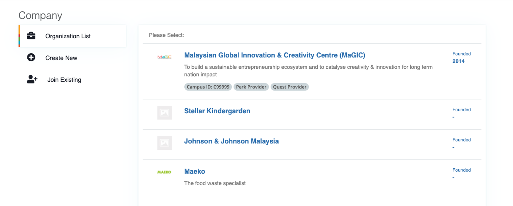
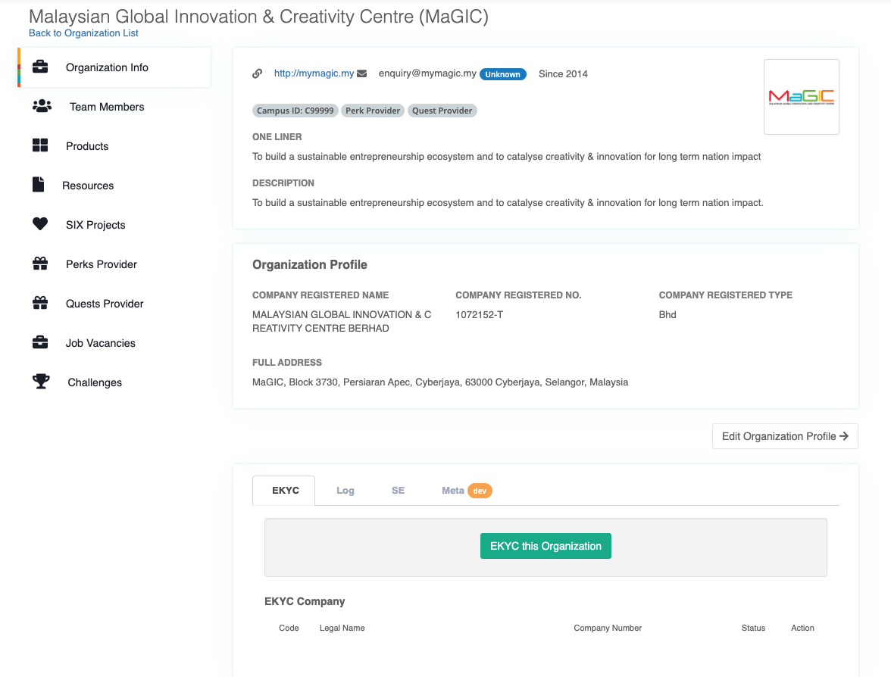

# EKYC for Companies

#### Manual Process

The Organisation EKYC verification process is all manual at the moment. Similar to 'EKYC for User' :

1. Login to `Member control panel`.

2\. Create new or select an existing Organization.

3\. Under `EKYC` tab, click `EKYC this Organization` button.

.png>)

4\. Applicant to input detail and upload required scanned ID documents. Submit when completed.

5\. Admin will process accordingly. Admin may raise question to applicant (e.g. to upload a clearer document) and the he/she will be notified thru email; or he/she can check thru the frontend interface at  `ekyc/frontend/manage`

#### Auto with SSM


This is a planned feature which is not implemented yet.

