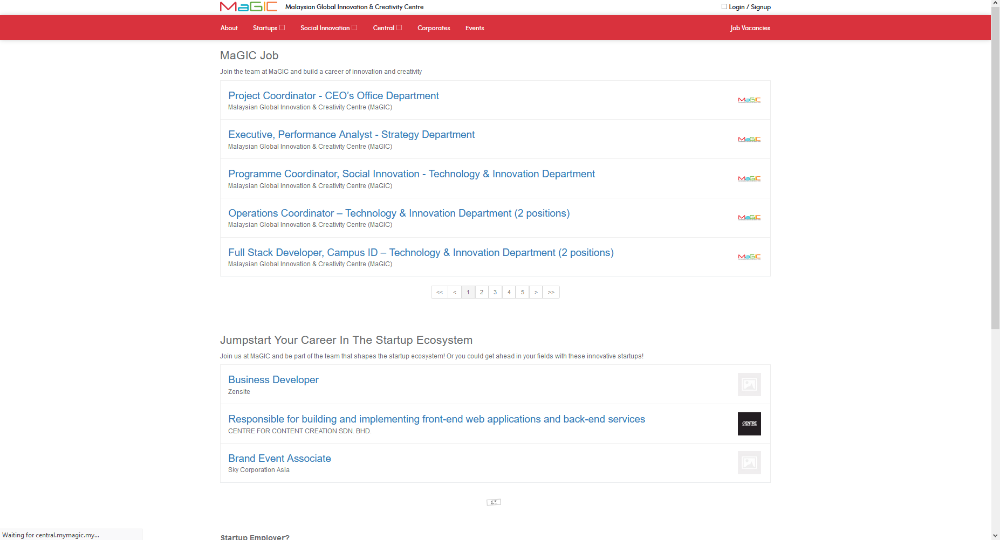
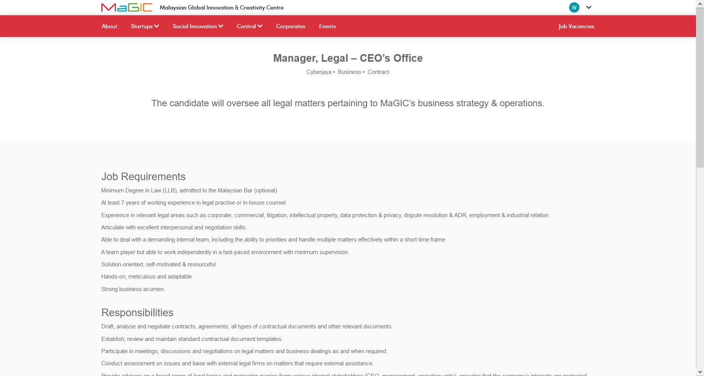
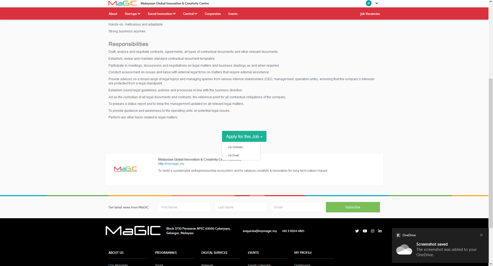
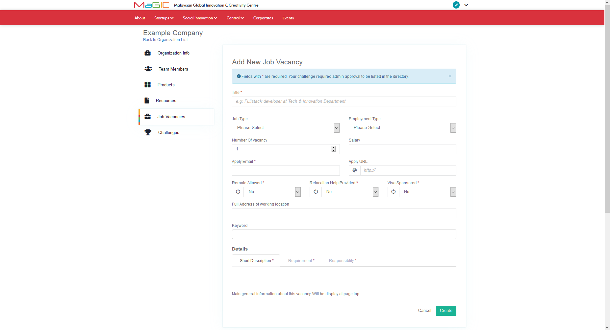
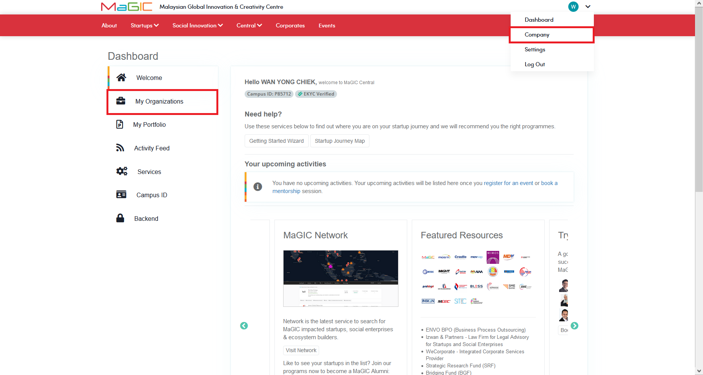
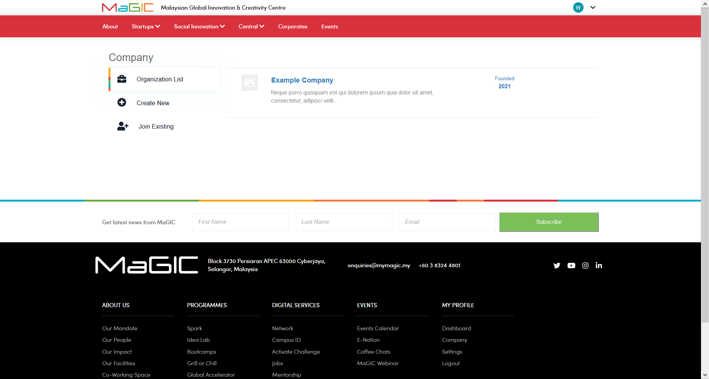
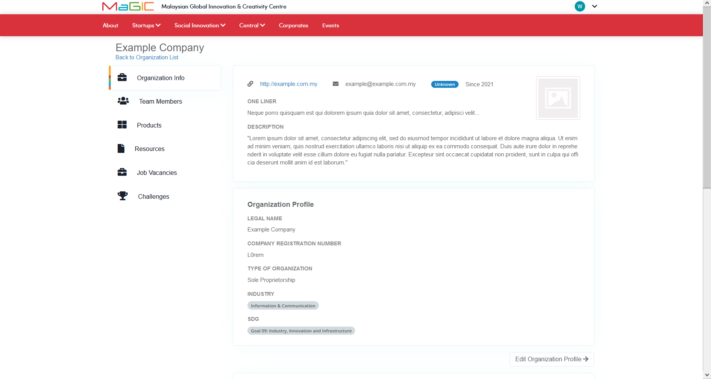
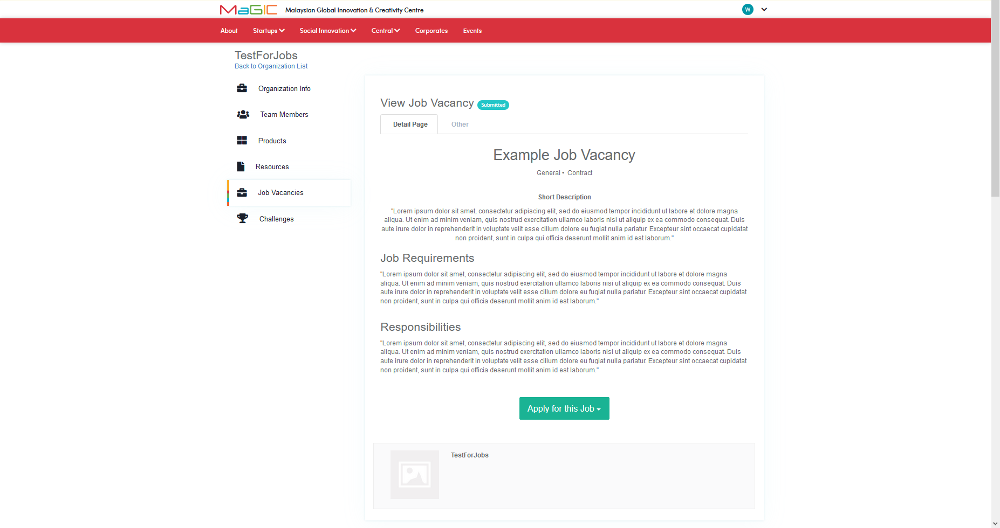
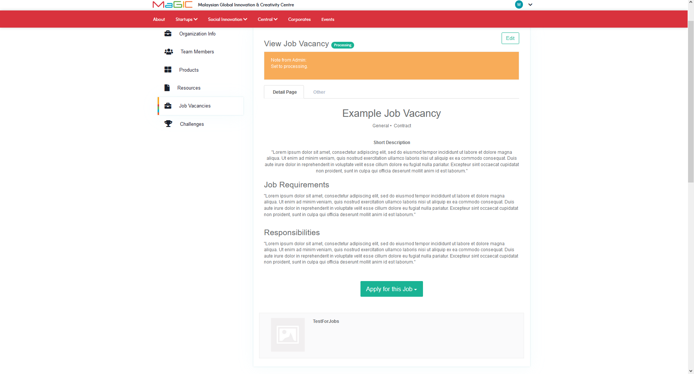

# Job

### Frontend Job Vacancies Directory

#### Accessing the Job Vacancies Frontend Page

The job section in the frontend can be accessed through the direct link below.



Alternatively, user can enter the job page by clicking Central &gt; Jobs on the top menu.

The job section is divided into MaGIC jobs and jobs from other startups. The MaGIC jobs, as the name implies, lists all the current available positions in MaGIC. On the other hand, jobs from other startups are listed in the community section. Job vacancies posted by startups will be displayed in the lower section.

The job section list up to 5 jobs per page for each particular section. To see more jobs from any section, click the arrow or page number to navigate to the other page.

User can click on a job title to learn more about a job offer.

User will be redirected to the detail page which houses various information such as job requirements, responsibilities, work location...etc. To apply for a job, user can click on the "Apply for this Job" button located near the bottom of the page. User can then choose to either apply via website or email.

### Posting job vacancy from Frontpage and member Control Panel

To post a job vacancy, there must be at least one organisation created under your own MaGIC account. If there is no organisation under the account, a new one should be made in order to start posting job vacancy. Refer [HERE](../../for-frontend-users/manage-my-organizations/).

#### Adding Job Vancancy from Frontpage

There are two ways to access the job posting page. The first way is to click the `Post a Job` button located near the bottom of the frontpage.    

User will be redirected to a page where the user can choose an existing organisation or create a new one. This example will demonstrate creating a job entry with an existing organisation. 

After selecting an organisation, user will be able to start adding a new job vacancy by filling up the details in the "Add New Job Vacancy" page.

Once the user has finished filling up the job vacancy info, the job listing can then be created by clicking the "Create" button near the bottom of the page.

#### Adding Job Vancancy from Control Panel

Alternatively, user can access the job posting page from the control panel by clicking either "My Organisations" on the left menu or "Company" on the top right.

User is then redirected to a page where a list of organisations are displayed. User can click on an organisation title to enter the detail page.

In this following page, the details of the organisation are shown. To continue with adding job vacancy, user can click on "Job Vacancies on the left menu.

In this next page, existing job vacancies posted by the users are shown. User can click on "Add" button to start adding job vacancies.

Once the user has finished adding the job vacancy info. The job listing can then be created by clicking the "Create" button near the bottom of the page. User will be shown with a success message.

After sending a submission, user can check the status of the submission by returning to the "Job Vacancies" page. 

#### Submission Status

The status of the submission is indicated by a small tag beside "View Job Vacancy". When the job vacancy is first submitted, the submission status will be labelled with "Submitted". The other status for job vacancy are "Processing", "Rejected" and "Approved".

When the job vacancy is set to "Processing", the applicant can rework the job vacancy before submitting it again to be approved by admin.

When the job vacancy is set to "Reject", the job vacancy is not accepted by MaGIC. However, the admin has the power to reset the status of the job vacancy submission to "Processing", this will allow the applicant to rework the job vacancy submission.

When the job vacancy is set to "Approved", the job vacancy submission has passed the approval process and will be displayed on the Central's job section.

### 

