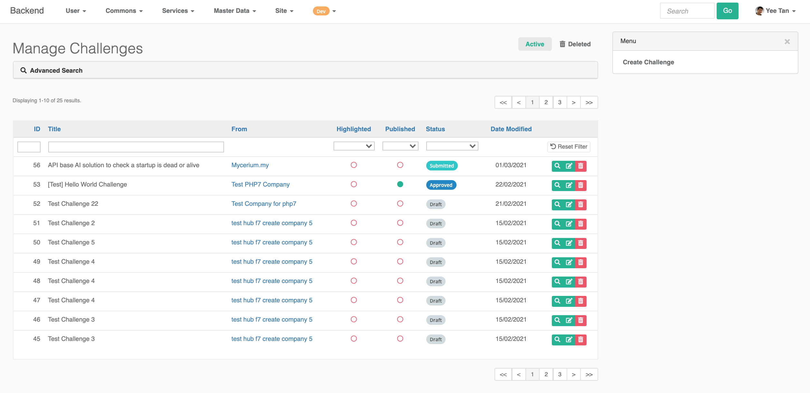
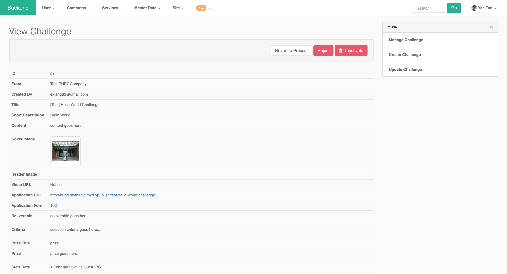
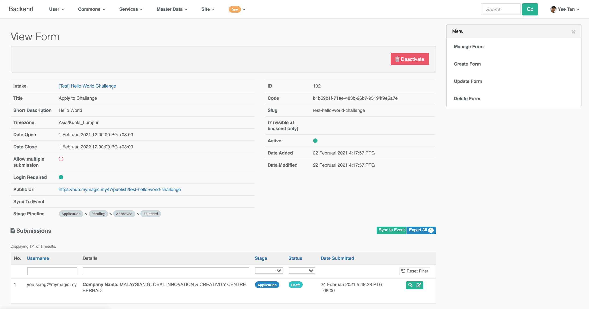

# Activate for Program Owner

### Backend

MaGIC Activate used `Challenge` module as backend and its management interface can be accessible thru:

`Backend` -&gt; `Service` -&gt; `Challenge` -&gt; `Manage`

### Workflow for Challenge \(Problem Statement\)

As an admin, you can perform the following workflow action onto a challenge submission by problem statement owner.

1. `new` - In draft mode, applicant not yet submit. Submission is editable by application in this stage.
2. `pending` - Submitted, pending for admin to process. Submission is **NOT Editable** by application in this stage.
3. `processing` - Processing by admin. Admin can post message to applicant for amendment. Submission is editable by application in this stage. After amended, applicant can resubmit and have their status reset back to stage 2. 
4. `approved`  
   1. Application approved by admin.
   2. Auto create participation form \(F7\) to take in solution provider submission for this challenge.
   3. Challenge is accessible in frontend.
5. `completed`- To mark this challenge as completed. Participation form is disabled.
6. `reject`- To mark this challenge as permanently rejected by Admin. 

### Workflow for Solution Provider

The entire workflow is handled by F7 Stage:

1. `application` - Submitted new application
2. `pending` - Pending for problem statement owner
3. `approved` - Proposed solution is approved by problem statement owner
4. `rejected` - Rejected by problem statement owner

An application can be edited under `draft` mode. Once submit in `submitted` status, application is not editable. However, before closing date, applicant can revert a submitted application back to `draft` for re-editing. 

### F7 Form Solution Provider Submission

You can manage all submission of a particular challenge by viewing the challenge.

Click link under `Applicaiton` form and you will be brought to the F7 form page in backend.

All submissions \(`draft` and `submitted`\) can be found here. Click into each of them, to view and to update its workflow stage.

