# ATAS

### The stage of ATAS Application

### Apply your Application

First, need to select your company and can be accessed through the direct link below:



#### Perform Apply for your application

Once select company, User can through the "Apply" button to apply their application in manage companies page.

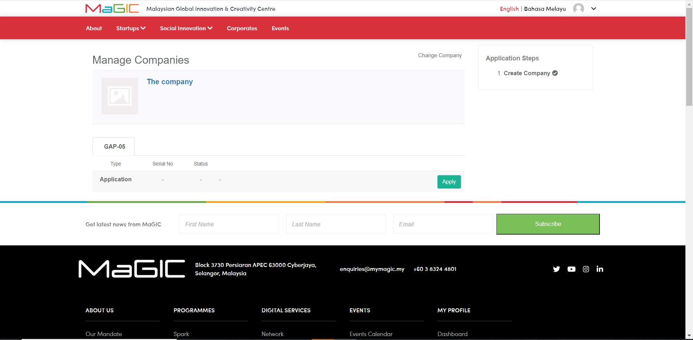

Fill up all the information in GAP 05 Application Form, save draft and submit.

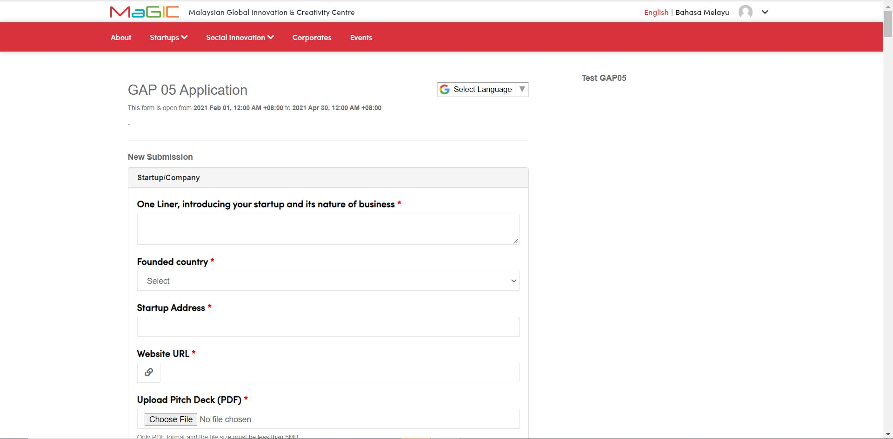

Once shortlisted user’s application status is change to Accepted, is automatically in pre-arrival stage. A ****"Create" Button will generate and user can process to PreArrial.

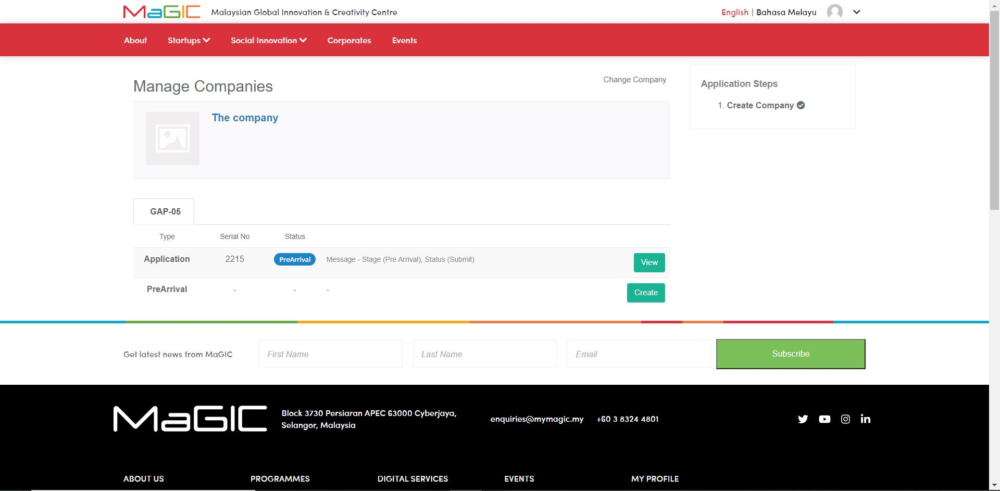

Fill up all the information in GAP 05 PreArrival Form, save draft and submit.

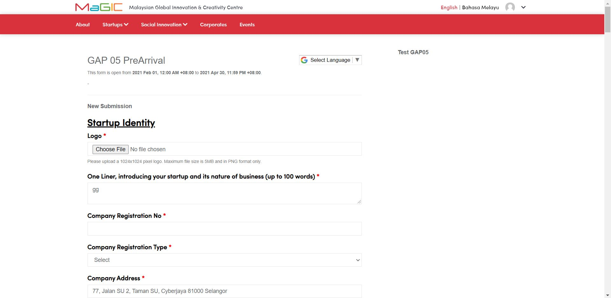

Once GAP 05 PreArrival Form Accepted and Convert to InProgram will able to using Milestone and Claim function

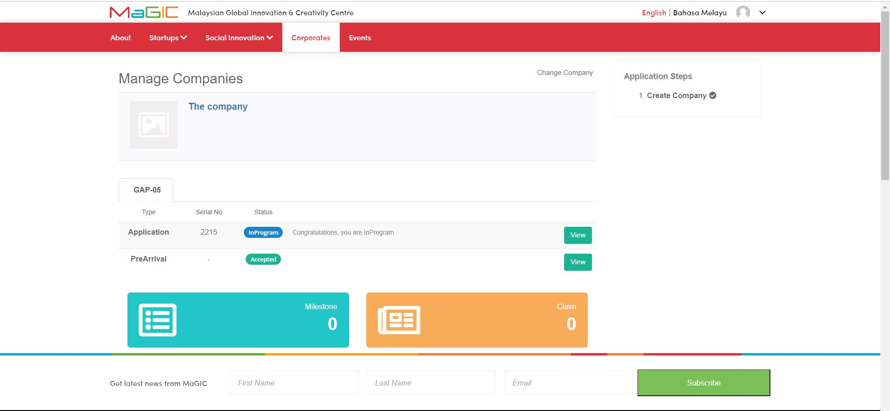

### How to Create and Manage Milestone for your Application

#### Overview of Milestone

Set your milestones & update their progress during your weekly platoon meeting.

#### Create Milestone for your Application

A "Create Milestone" button in the top of list.

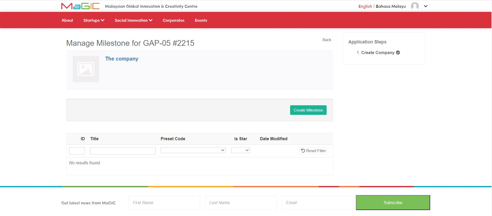

Fill up information of Milestone and create.

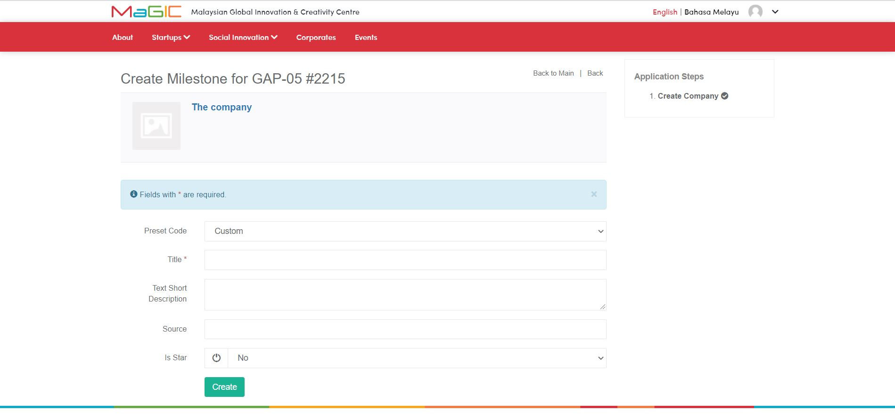

#### Manage and Edit Milestone for your Application

User can Edit and View Milestone in milestone page. User can edit Preset Code, Title, Text Short Description, Source and Is Star.

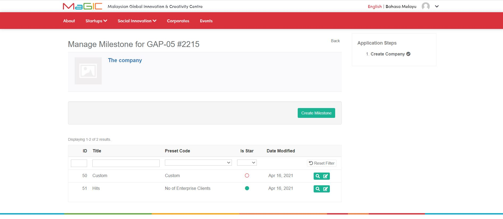

### 

### How to Create and Manage Claims for your Application

#### Overview of Claim

Submit new claim, track your claims’ status as well as printing the claim submission form.

#### Create Claim for your Application

A "Create New" button in the list.

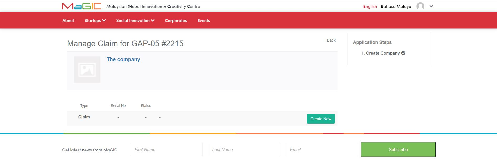

Fill up information of Client, save draft and submit.

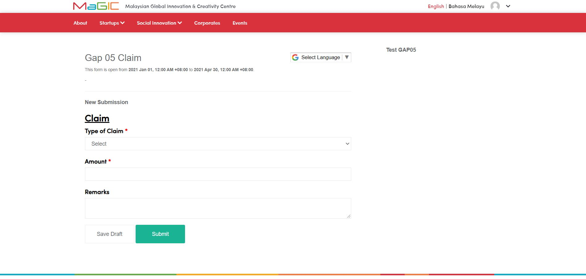

#### How to check the status of claim

User Can check and view the status of Claim \(Approved or Rejected\) in the claim page.

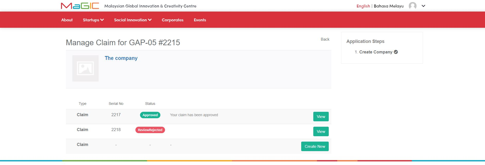

