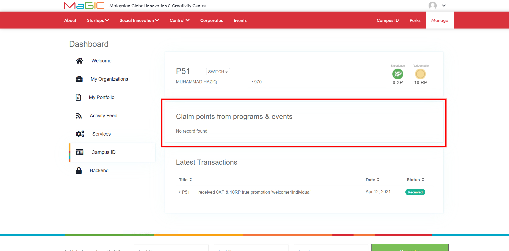

# Campus ID

### Overview

Everyone with a MaGIC CENTRAL account can sign up to Campus ID for FREE. Campus ID Member then can collect points by participating in MaGIC selected events and programs, or by helping startups completing `QUEST`. Then, they can spend the point to redeem perk that helps their startup grow. By leveling up thru the journey, they gain badges of honors which used by the program owner for assessment.

### XP vs RP points

#### Experience Points \(XP\)

Experience Points \(XP\) is earned as you join & complete certain programs from MaGIC. Your XP will grow as you go through the startup journey with MaGIC. Higher amount of XP will allow access to more relevant things base of your experience. XP will also be used as an assessment & qualification checks.

#### Redeemable Points \(RP\)

Redeemable Points \(RP\) is earned as you join & complete certain programs from MaGIC. RP also can be earn by completing task offered on Perks portal. Your accumulated RP can be used to redeem perks that is offered by our perks providers. Perks can help your grow your ideas & startups.

### Individual vs Organization Membership

#### Individual membership

An individual membership belong to a single person. XP & RP accumulated is only applicable to a single person. To get an individual membership, you will need a verified Malaysian IC Card or a password.

#### Organization Membership

An organization membership consist of one or more individual membership. XP & RP accumulated will be assigned to the organization. To get an organization membership, you will need a SSM \(Suruhanjaya Syarikat Malaysia\) Registration Number. 

### Activate your Campus ID

#### Perform Individual EKYC using mobile phone and MyKad \(auto process\)

* Login into your central account \([or signup](../../../for-frontend-users/magic-account.md)\) and head to your [Cpanel](https://central.mymagic.my/cpanel/) & click the "Campus ID" link on the navigation menu.

* You will automatically redirect to the "Auto Identify Verification" page. 
* Scan your ID with your smartphone camera by tapping on the camera icon or upload a photo of your ID from your smartphone's gallery.

* You will see a "eKYC Successful" when your id is automatically verified.  Click here if your are on a desktop [EKYC for User](../ekyc.md#ekyc-for-user).

#### Fall back to manual process if failed

* If the automatic eKYC process fails, you will be redirected to the manual process for eKYC. Fill in the form with the correct information. Your application will be manually verified and will take 3-5 working days.

#### Agree to terms & conditions

* Once your eKYC has been approved either automatically or manually, navigate to your [Cpanel](https://central.mymagic.my/cpanel/) 

   & click on the "Campus ID" link.

* Read through the term & condition and click on the "I Agree" button to proceed with the Campus ID activation.

#### Obtain your Campus ID

* After agreeing to the term & conditions, you will obtain your Campus ID membership code e.g. ‘P12345’.

#### For user with multiple CENTRAL Accounts

* Your Campus ID membership is tied to your IC/passport number. If you register multiple Campus ID membership, all of the account will be linked together under the same IC/passport number.
* To add a CENTRAL account to your Campus ID, simply login into the account & complete the eKYC process using the same IC/passport document. Multiple account with the same IC/passport document will be linked together.

### How to get Campus ID for your startup

#### Required individual Campus ID

#### Perform Organization EKYC \(manual process\)

// brief with screenshots, with link to [EKYC for Organization](../ekyc.md#ekyc-for-organisation)

#### Obtain organization Campus ID

// Obtain ID like ‘C12345’

### Manage everything at Member Control Panel

// with screenshots

### Claim points from participated events and programs

* To claim points login into your Campus ID account & navigate to your Campus ID dashboard. In the "Claim points from programs & events" section, you will see all the event that you joined & are eligible for points redemption.

### Redeem a Perk

* Login into your Campus ID account & navigate to the "[Perks" ](https://central.mymagic.my/campus/perks)page. In the "Perks" page you can see all the available perks that are offered.

* Click the redeem button on any of the perks to redeem. Note that you can only redeem perks if you have equal or more experience \(XP\) & redeemable points \(RP\) required by each perks.

### Earn points from Quest

// with screenshots

