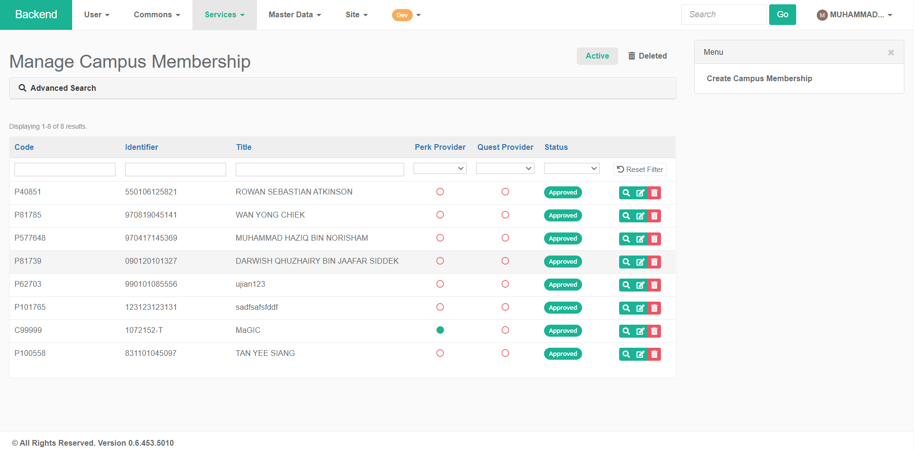
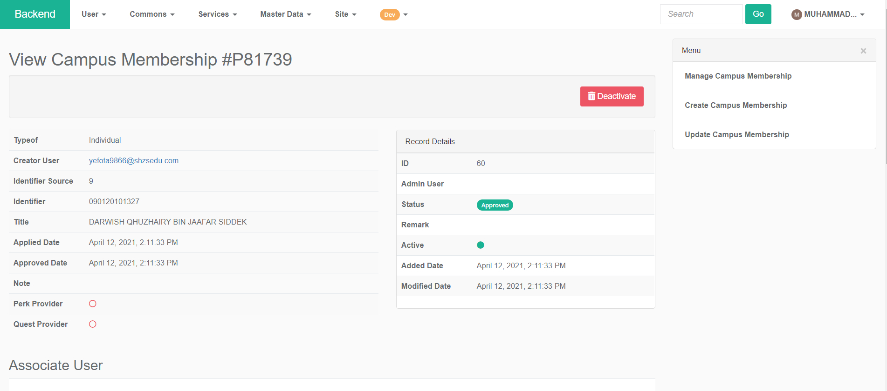
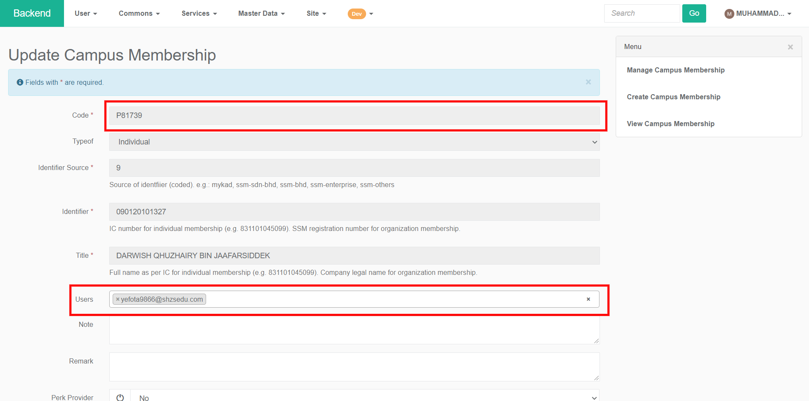
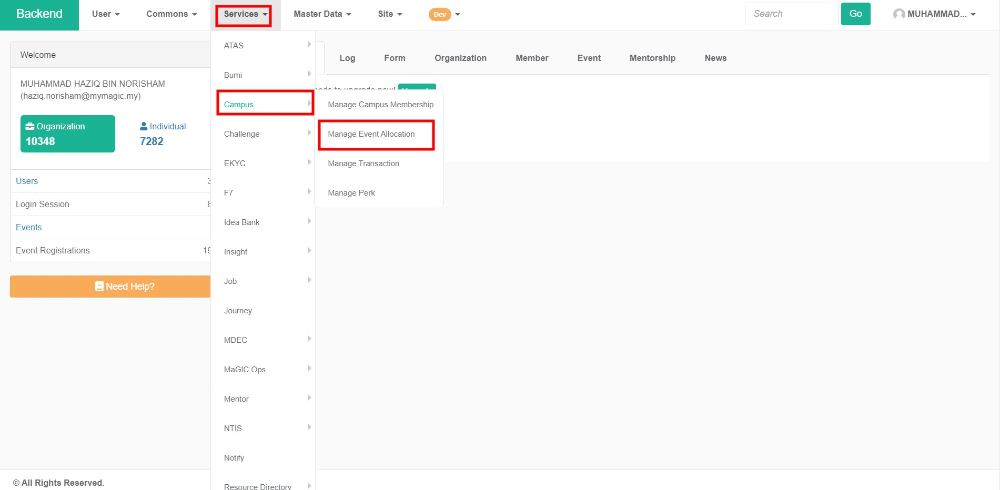
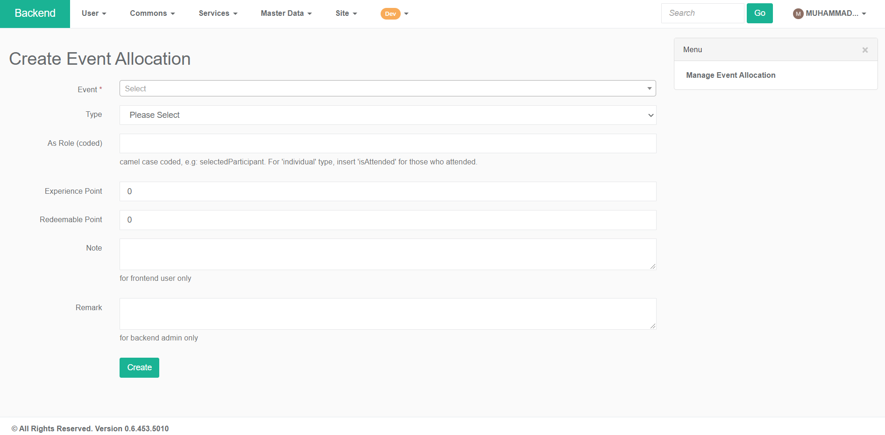

# Campus ID for Admin

### Manage Campus Members

* Login into your magic account and navigate to [backend](https://central.mymagic.my/backend/).
* To manage campus members navigate to `Service -> Campus -> Manage Campus Members`

* In the "Manage Campus Membership" page, you can see a table that lists accounts that has successfully been registered for Campus ID.
* Column Description : 
  * **Code** - Displays the Campus ID membership ID number.
  * **Identifier -** For individual membership, the value should be the person's IC number while organization should be the organization's SSM registration number.
  * **Title -** The name of the registered person / Name of the organization.
  * **Perks Provider** - Green circle shows the member are one of the perks providers for Campus ID.
  * **Quest Providers** - Green circle shows the member are one of the quest providers for Campus ID
  * **Status** - Shows the current status of the member.

#### View Membership Details

* To view get more detailed information about each Campus ID member, click on the magnifying glass icon in the right most column.

#### Update Membership

* To update each Campus ID member, click on the pen & paper icon in the right most column.
* In the "Update Campus Membership" page, a greyed out field is not editable because the field is automatically populated during the eKYC process. A non-greyed out field can be edited
* The users field will show a list of all the emails that are tied to the same person.
* Click the save button at the bottom of the page to save the changes that has been made.

#### Deactivate Campus ID Membership

* To deactivate a Campus ID member, click on the red trashcan icon in the right most column. Deactivated will be moved to the recycle bin and can be reactivated.

### Allocate points to an event

* Login into your magic account and navigate to [backend](https://central.mymagic.my/backend/).
* To manage campus members navigate to `Service -> Campus -> Manage Event Allocation`

#### Allocate XP & RP to event

* Click on the "Create Event Allocation" link to start allocating experience \(XP\) and redeemable point \(RP\) to an event.

* In the "Create Event Allocation" fill all the required fields and click the "Create" button to allocate points to the event.
* Field description:
  * **Event** - A dropdown list where you can search event that has been created.
  * **Type -** Types of Campus ID membership either Individual or Organization.
  * **As Role** - selectedParticipant will grant the reward to the selected participant while isAttend will only grant the reward only when the individual attend the event.
  * **Experience Points** - The amount of experience points to give to participants. 
    * \(Ensure that this is the correct value, once the event allocation is created, updating this value will not change the amount that participants receive\)
  * **Redeemable Points** - The amount of redeemable points to give to participants. 
    * \(Ensure that this is the correct value, once the event allocation is created, updating this value will not change the amount that participants receive\)
  * **Note** - Additional notes that will be displayed to the participants.
  * **Remart** - For backend admin use only.

### Manage transactions

/\* I should not beable to edit allocated points. To adjust, i just need to add another new transaction. I should not beable to delete a transaction I can view the detail of a specific transaction\*/

#### Manually add point to a member

#### Manually deduct point from a member

### Manage Perks

