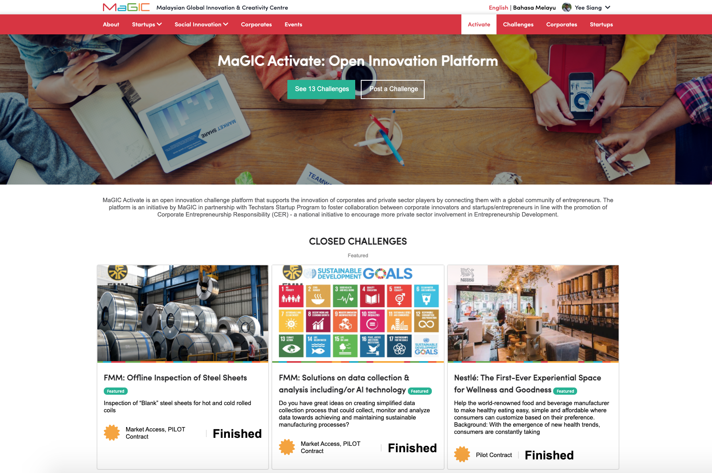

# Activate

Activate is an open innovation challenge program that brings problem statement owner \(e.g.: Corporate, government, SME\) and solution provider \(e.g: startup, social enterprise\) together.

Built on top of the challenge module, it is now a digital platform that empower anybody to post their problem statement seeking for startup solution to help solving.

