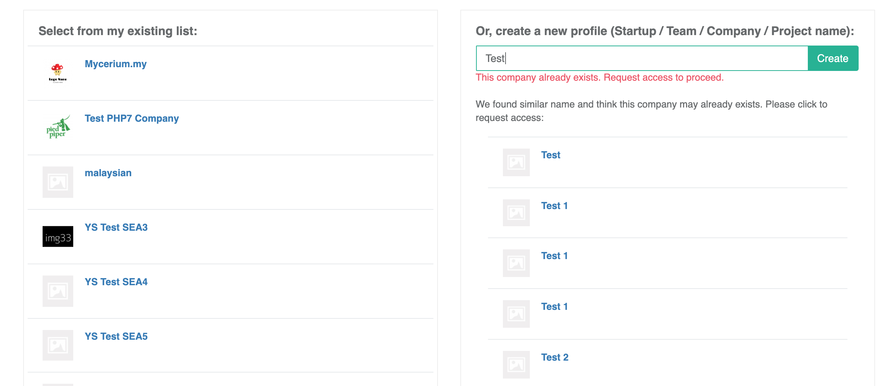
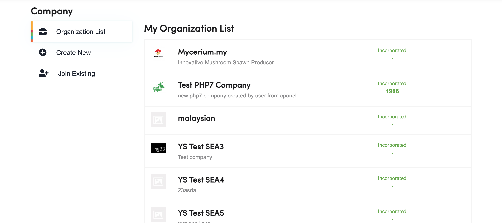
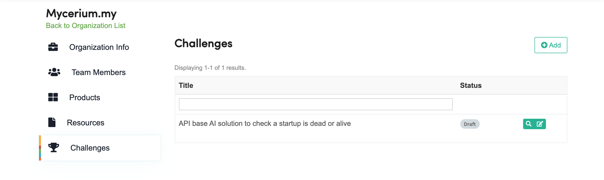
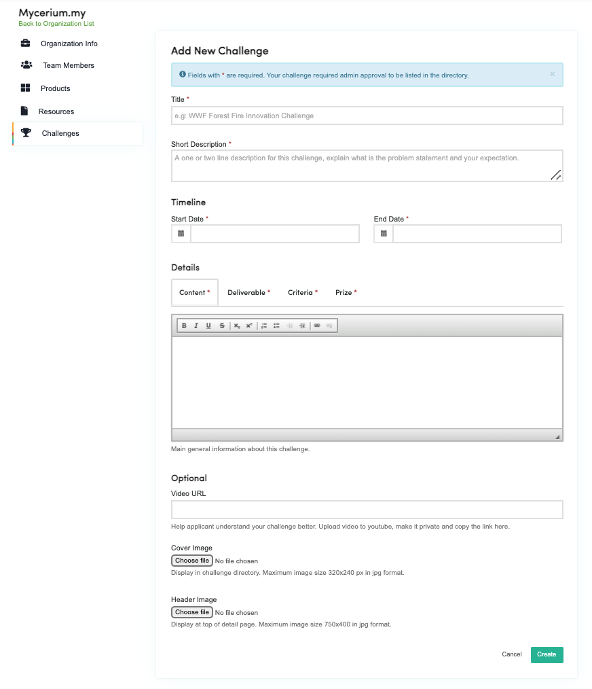
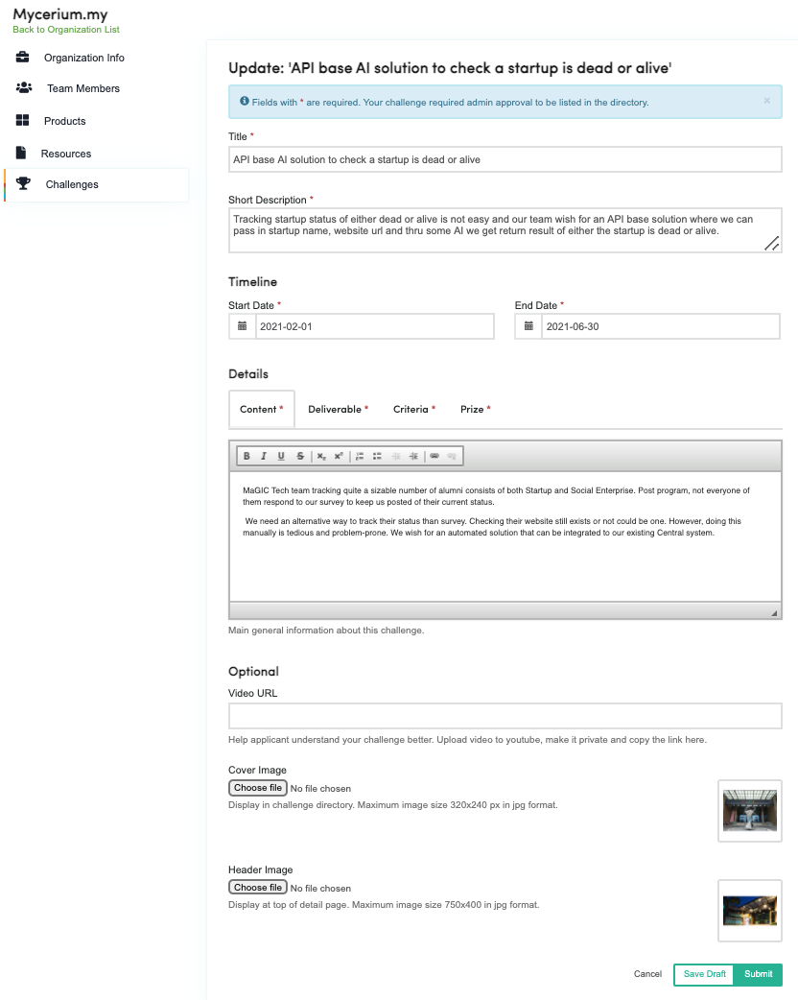

# Activate for Problem Statement Owner

In the past, big corporate is the focus and only source of problem statement supply. However, with a true open innovation challenge platform, we empowered everyone to utilise this platform regardless of their size and background, from sme to government and even individual. 

### Post your problem statement

You need a Central user account to proceed. After login, you may post it either thru the MaGIC Activate main page or Member Control Panel.

### Method 1

#### Select existing or create new Organisation

* Select an existing organisation of yours from the left
* Or, insert a name for your new organisation
* You may proceed to create the organisation profile if new
* If the organisation profile exist, you may request for the permission from its owner to join.

Upon completion, proceed to \`**Submit a challenge \(Problem Statement\)**'

### Method 2

#### Select existing or create new Organisation


You will need an organisation profile to host a challenge. Create new or join existing one to proceed.


Upon completion, proceed to \`**Submit a challenge \(Problem Statement\)**'

### Create a challenge

Click `Add` button and you will have to fill up a form to post:

* Each posted challenge has an open and close date. Recommended timeframe between these two dates is not more than 6 months.
* Although optional, do provide a cover and a header image to make your challenge stand out from the rest. Plain color background use by default.
* Create `Create` button to save it as draft.

### Submit a Challenge

Click `Submit` button and you will not be able to revert to editing mode.

### Getting Featured

### Receiving application from Solution Provider

