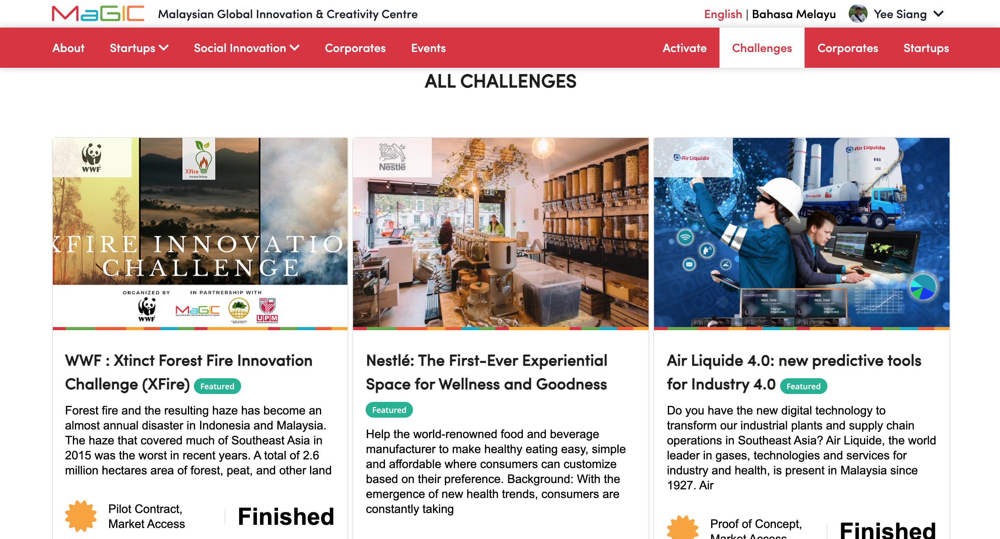

# Activate for Solution Provider

Solution Providers are individual or organisation like team, startup and social enterprise who can provide solution to a challenge \(problem statement\).

Solution Provider interact with MaGIC Activate service from the `frontend` as well as `member control panel`.

### Browse Challenges

Featured challenges are listed on the front page while all including non-featured are listed on the `Challenges` page, sorted by latest challenge on top \(base on closing date\).

### Propose a Solution

Solution provider \(Startups, Social Innovator\) may click into a specific challenge to learn more on its detail like expected deliverable, selection criteria, prizes and timeline. 

After decision made, he may proceed to propose solution to this challenge by clicking `Participate` button on the right.

A form will show up.

Fill up and submit before the closing date. You are not allowed to edit it when it is in `Submitted`stage. However, before closing date, you may revert a submission back to `Draft` stage for editing.

### After Submit

The application status is now `Submitted`

Applicant submission will be managed by program owner or admin, following '**Workflow for Solution Provider**' stated here:



### Others

