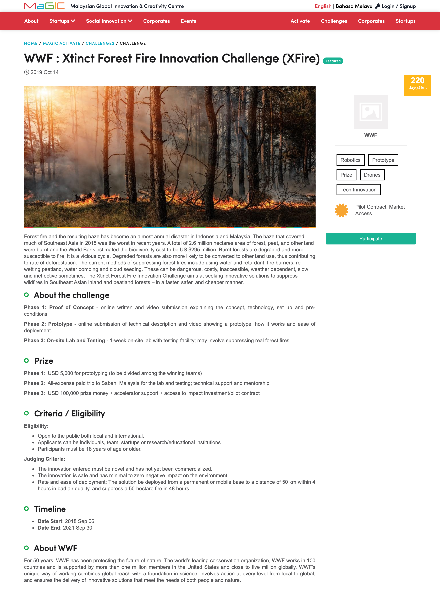

# Activate for Solution Provider

Solution Providers are individual or organisation like team, startup and social enterprise who can provide solution to a challenge \(problem statement\).

Solution Provider interact with MaGIC Activate service from the `frontend` as well as `member control panel`.

### Browse Challenges

Featured challenges are listed on the front page while all including non-featured are listed on the `Challenges` page, sorted by latest challenge on top \(base on closing date\).

### Propose a Solution

Solution provider may click into a specific challenge to understand its detail such as expected deliverable, selection criteria, prizes and timeline. 

After decision made, he may proceed to propose solution to this challenge by clicking `Participate` button on the right.

A form will display.

Fill up and submit before the closing date.

