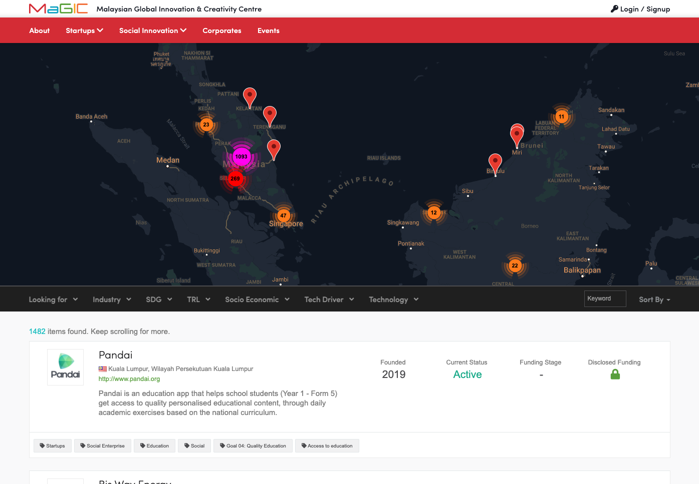

# Network

Network is a module that to replace community. Inspired by StartupSg and StartupBlink, it provides map  driven filter to browse and search alumni.

### Integrate with Resource Directory

Network service is integrated with [Resource Directory](../open-source-modules/resource-directory.md). For example, clicking a startup from 'Global Accelerator Program' will be able to link you to this specific resources under resource directory. From there, not only you can learn about the program but also access to list of startups benefited by it.



### Data Source

Our data came from these sources:

* Application form that startup submitted
* Organisation information that startup updated thru Member Control Panel
* Survey answered by the startup
* Public information found on social media
* Public information on the internet \(crunchbase, data.gov.my, etc\)

