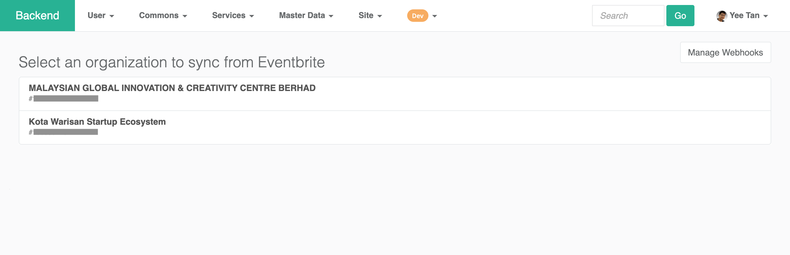
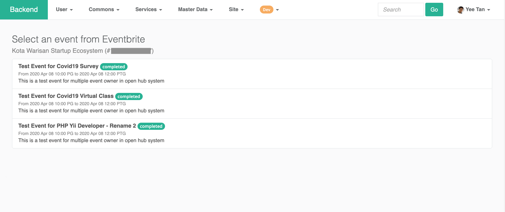

# Eventbrite

Eventbrite module not only sync event and participants data from Eventbrite accounts, but also provide frontend interface for CENTRAL member to register a published event.

### Frontend

The purpose of the frontend, 

### Sync from Eventbrite

how? will sync clear and override existing data?

### Manage Webhooks

how to add webhook? how to get those variable from eventbrite?

`Commons` &gt; `Event` &gt; `Event` &gt; `Sync from Eventbrite` &gt; `Manage Webhooks`

