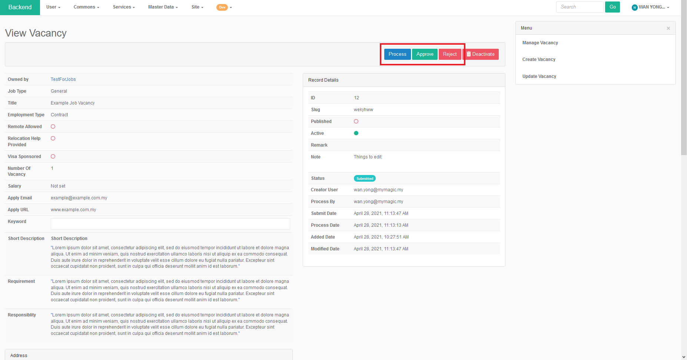

# Job for Admin

### Adding Job Vacancies from Backend

To add job vacancies from backend, first enter the job section in backend using the direct link below.



Alternatively, the job section can be accessed from the backend by clicking Services &gt; Job &gt; Manage Vacancy.

Once arrived at the "Manage Vacancy" section, user can click on the "Create Vacancy" on the top right to start adding new job vacancy in the "Create Vacancy" page.

User will be redirected to "Create Vacancy" page where details for a job vacancy can be added.

Once all the details are added, user can click the "Create" button near the bottom of the page to create a new job vacancy entry.

### Approval Workflow

When a startup submits a job vacancy entry, the admin role is to verify the the job submission from the startup. There are several options the admin can label the submission with, which includes "Processing", "Approve" and "Reject".

The following flowchart demonstrates the basic flow of the approval process.

#### Processing

The "Processing" step is used to notify the applicants to fix any problems with the submission. Once the problem is rectified by the applicant, the applicant can submit the job vacancy again for approval. The submission label will be reverted to "Submitted" from "Processing".

After clicking the "Processing" button, the admin can inform the applicant on any problems that requires fixing with a message. 

#### Reject

The "Rejected" step is used to reject a submission. Similar to the "Processing" stage, the admin can write a message to the applicant along with the rejection.

The admin can also set the "Rejected" submission back to "Processing" status. The applicants will then be able to rework the job vacancy post before submitting it again for approval.

#### Approve

The "Approve" step is used to approve a submission. Once the submission is approved, the job vacancy entry will shows up on the Central's "Job" section.

