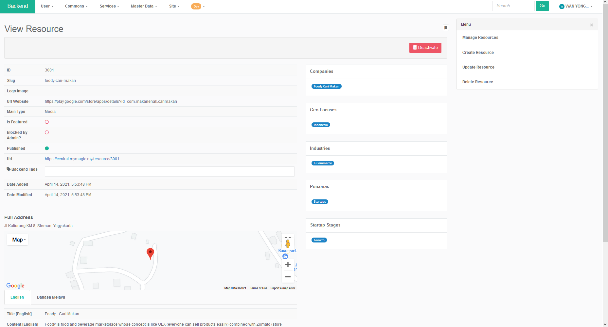

# Resource Directory

### Different type of resources

The are different types of products and services provided by various organisations, the resources can be divided into different categories such as Fund, Space, Award, Program, Media, Legislation and Others. Whereas the company stage can be divided into different stages such as Discovery, Validation, Product Development, Efficiency, Growth and Mature.

### 

### Frontend Resource Directory

#### Accessing Frontend Resource Directory

The resource directory frontend can be accessed through the direct link below



Alternatively, user can access the resource directory frontend by navigating to the Featured Resources under the Card section, then click "and more..." to access the resource directory page.

### 

### Manage Resources from Control Panel

#### Accessing page to manage resource from Control Panel

To manage resources from control panel, first enter the control panel using the direct link below. You may be prompted to login before access to the page is granted.



Once the page redirects to the control panel, click the "My Organisation" on the left item menu to enter the organisation page.

#### Steps to manage resource data

If an organisation hasn't been made yet, it can be created by clicking "Create Company". Once the required data is filled in, click "Create Organisation" button to create a new entry for your organisation.

The resource can then be managed by clicking the "Resource" on the left menu bar. 

In the resource page, a new entry can be made by clicking the "Add" button.

Once the required data is filled in, click "Create Resource" button to create a new resource entry.

### 

### Manage Resources from Backend

#### Accessing the Manage Resource Page \(from backend\)

To manage resources from backend,  first enter the backend page using the direct link below. Admin privileges is required to access the backend. You may be prompted to login before access to the page is granted. 

Alternatively, user can access the backend from the control panel by clicking the "Backend" on the left item menu when logging in with user that have the right privileges.



Once arrived at the backend page, the user can enter the "Manage Resource" page by clicking "Service" &gt; "Resource Directory" &gt; "Resources" on the top menu bar.

#### Accessing the "Manage Resource" page \(direct link\)

User can also enter the "Manage Resource" page using the direct link below.



#### Manage Resource Page

User can start to manage resource at the "Manage Resource" page.

There are three actions that can be performed on each data entry. The actions are "View", "Update" and "Deactivate", the functions are mapped to the icons in the same order as shown in the picture below. 

#### Viewing Resource data entry

When the view button is clicked, the user will be brought to the "View Resource" page for the particular data entry. In this page, the user will be able to see more detailed data for a particular resource entry. Lastly, user can also deactivate a particular data entry from the view page.

#### Updating Resource data entry

When the update button is clicked, the user will be brought to the "Update Resource" page for the particular data entry. In this page, the user will be able to update the data for a particular resource entry.

#### Deactivating Resource data entry

When the deactivate button is clicked, the user will be presented with a warning page. In this page, the user will be able to confirm whether the data is to be deactivated or not. To deactivate a particular entry, click OK to perform the action. Otherwise, select Cancel to return to previous page.

### 

### Link resource to an event group

To link resource to an event group, first enter the resource page within the backend using the link below.



To link resource to an event group, click on the view button for a particular event. Then scroll to the bottom of the page and click "Event". Finally, click the "Link Event Group" to start linking resource to an event group.

The button will redirect user to a page that will allow user to start linking resource to an event group.

### 

### Manage Resource Category

#### Accessing the "Manage Resource Categories" page \(direct link\)

To manage resources ****category from backend,  first enter the "Manage Resource Categories" page within the backend using the direct link below. Admin privileges is required to access the backend. You may be prompted to login before access to the page is granted.



#### Manage Resource Categories Page

User can start to manage resource categories at the "Manage Resource Categories" page.

There are three actions that can be performed on each data entry. The actions are "View", "Update" and "Deactivate", the functions are mapped to the icons in the same order as shown in the picture below. 

#### Viewing Resource Category data entry

When the view button is clicked, the user will be brought to the "View Resource Category" page for the particular data entry. In this page, the user will be able to see more detailed data for a particular resource category entry. Lastly, user can also deactivate a particular data entry from the view page.

#### Updating Resource Category data entry

When the update button is clicked, the user will be brought to the "Update Resource Category" page for the particular data entry. In this page, the user will be able to update the data for a particular resource category entry.

#### Deactivating Resource Category data entry

When the deactivate button is clicked, the user will be presented with a warning page. In this page, the user will be able to confirm whether the data is to be deactivated or not. To deactivate a particular entry, click OK to perform the action. Otherwise, select Cancel to return to previous page.

### Manage Resource Geo Focus

#### Accessing the "Manage Resource Geofocuses" page \(direct link\)

To manage resources geo-focus from backend,  first enter "Manage Resource Geofocuses" page within the backend using the direct link below. Admin privileges is required to access the backend. You may be prompted to login before access to the page is granted.



A list of entries for different regions are displayed in the page.

#### Manage Resource Geofocuses Page

User can start to manage resource geofocus at the "Manage Resource Geofocuses" page.

There are three actions that can be performed on each data entry. The actions are "View", "Update" and "Deactivate", the functions are mapped to the icons in the same order as shown in the picture below. 

#### Viewing Resource Geofocuses data entry

When the view button is clicked, the user will be brought to the "View Resource Category" page for the particular data entry. In this page, the user will be able to see more detailed data for a particular resource category entry. Lastly, user can also deactivate a particular data entry from the view page.

#### Updating Resource Geofocuses data entry

When the update button is clicked, the user will be brought to the "Update Resource Category" page for the particular data entry. In this page, the user will be able to update the data for a particular resource category entry.

#### Deactivate Resource Geofocuses data entry

When the deactivate button is clicked, the user will be presented with a warning page. In this page, the user will be able to confirm whether the data is to be deactivated or not. To deactivate a particular entry, click OK to perform the action. Otherwise, select Cancel to return to previous page.

