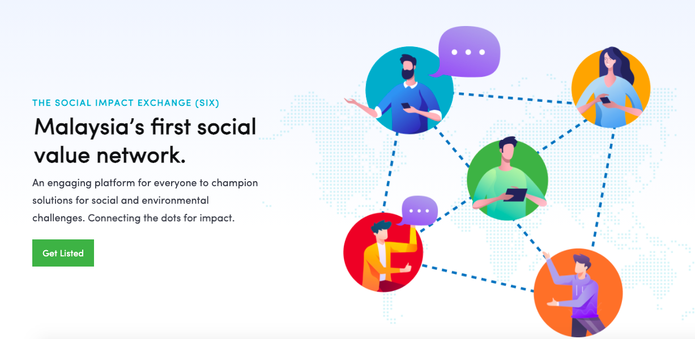
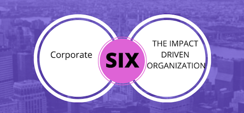
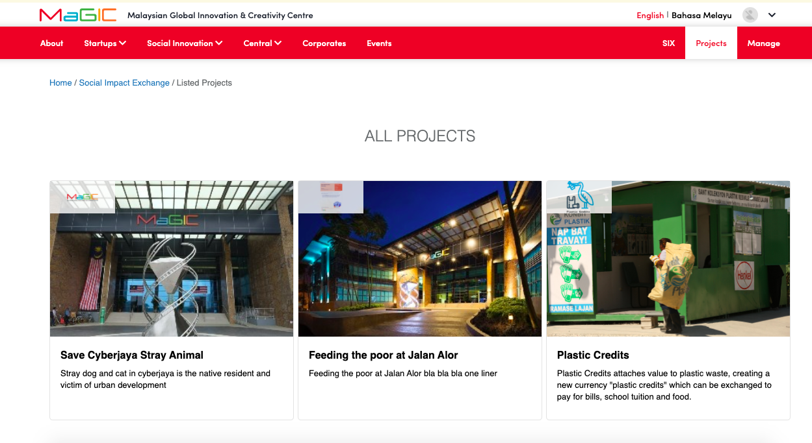

# SIX

### Overview

A curated platform by MaGIC to bring together a community of impact-driven Malaysian organizations, investors, and corporates together to encourage purpose-driven collaborations \(non-financial & financial\) and resource exchange \(writings & insights\).  

### Audience of SIX

#### **1. THE CORPORATE**

An online directory to browse through for-profit and non-profit organi**z**ations and active projects related to their field of interests in which they can support financially or non-financially. Insightful readings and opinions from IDOs regarding a range of topics such as experience working in the field, the gaps and need for funding, the power of partnerships, etc.   

2. **THE IMPACT DRIVEN ORGANISATION**

An online profile of their organization and their type of assistance they would like from corporates or fellow IDOs. This can range from financial to non-financial assistance. Having a public profile increases their visibility to the public and corporates  

### How SIX works

SIX is a project listing platform for Impact Driven Organisations \(IDOs\) to create a project page capturing the problem, solution, and assistance they require. In turn, funders and experts can browse through to identify projects of interest - connecting directly with the IDO for possible funding or capacity-building support through SIX.

#### **1.  Projects listed tell their story and support they need** 

An IDO’s existence starts with tackling a social or environmental problem. They come up with solutions and at times we all need additional support, financially or non-financially. SIX is the place to tell your project story constructively, containing the necessary info and tags for funders and experts to find and connect with your project.

#### **2. Browse and identify projects to fund and help** 

Be it as an individual or organization you can provide help through funding and skills you have to offer. Filter through projects verified by MaGIC and find something that speaks to you.

#### **3. Connect for collective impact and value exchange** 

Get in touch directly with the IDO of the project you are interested in to lend a hand. Drop them a message via SIX to connect and continue the conversation on any platform of your choice. 

### View listed projects

### 

### 

  
  
  

