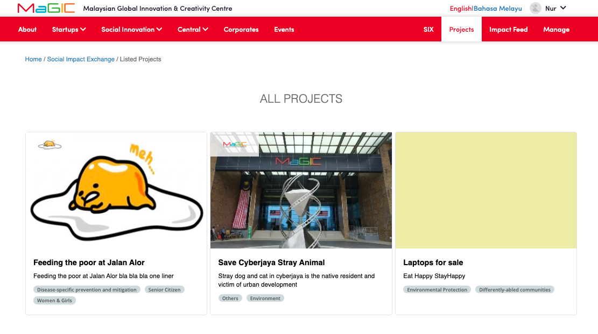
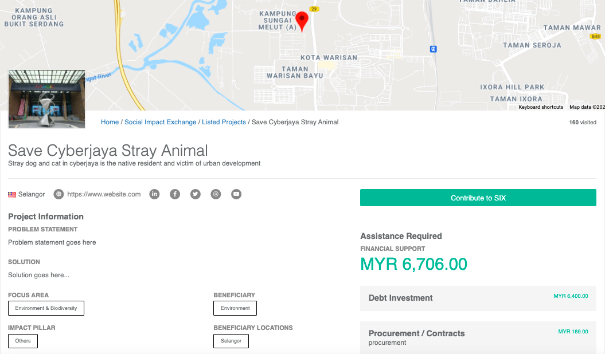
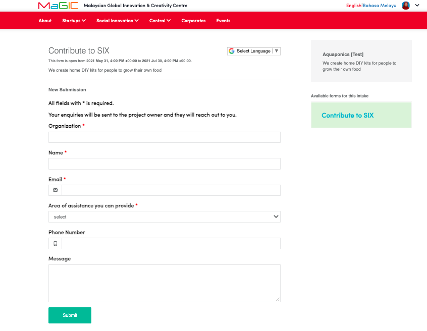

# Six for Corporate

### Browse Projects

Featured projects are listed on the on the `Project` page

### Contribute to Project

A form will show up directing from the 'Contribute to SIX' button

Fill up and click the 'submit' button.

### After Submit

The application status is now `Submitted`

Applicant's submission will be managed by program owner or admin.

