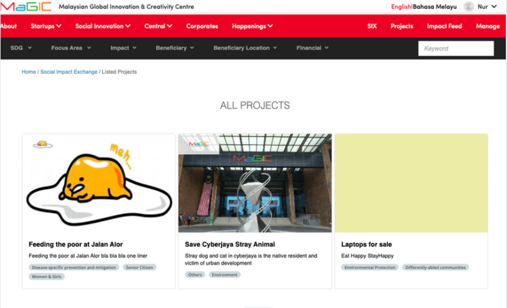

# Six for Corporate

### Browse Projects

Featured projects are listed on the on the `Project` page, Projects listed on this page will be available to view by public and interested corporate who are interested to contribute to the project of their choice. Projects are available to be browse and the details can be view by choosing the project title. 

### Contribute to Project

A form will show up directing from the 'Contribute to SIX' button,  Interested corporate can fille up the form to get know or contact with the project owner

Once the form is opened, fill up and click the 'submit' button. 

The pop-up indicates, the form has been submitted and went through, the project owner will be notify and they will contact you directly.

The corporate can continue browsing for other projects if interested and wait for their reply through email or given contact contact information

### 

