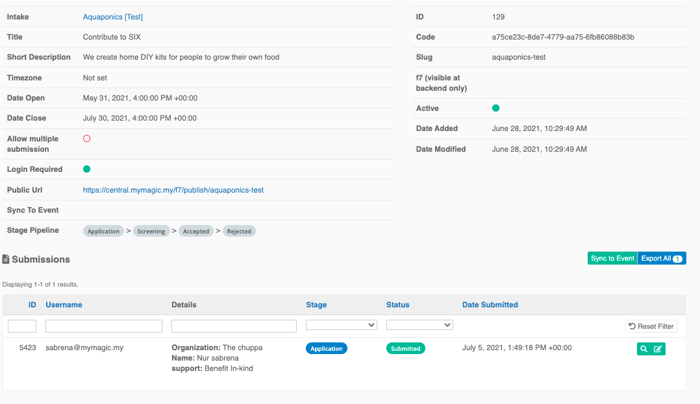
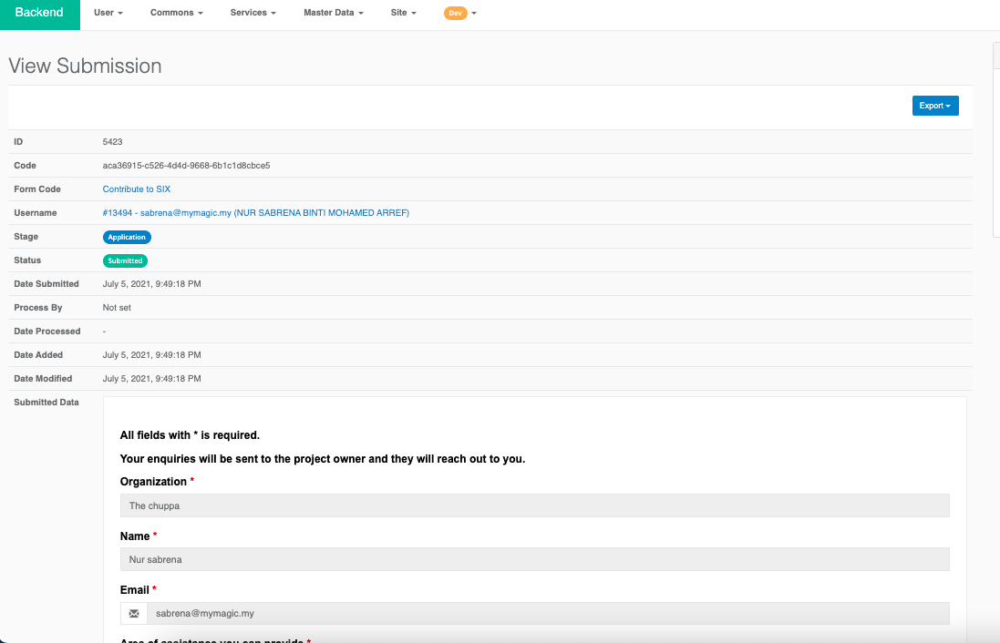

# SIX for Program owner

### Backend

MaGIC's Social innovation Exchange used `SIX` module as backend and its management interface can be accessible thru:

`Backend` -&gt; `Service` -&gt; `Social Impact Exchange` -&gt; `Manage Project`

### Workflow for SIX \(Problem Statement\)

As an admin, you can perform the following workflow action onto a project submission by the problem statement owner.

1. `new` - In draft mode, the applicant has not yet submitted. Submission is editable by the application at this stage. 
2. `processing` - Processing by admin. Admin can post messages to the applicant for amendment. Submission is editable by the application at this stage. After being amended, applicants can resubmit and have their status reset back to stage 2. 
3. `approved`  
   1. Application approved by admin.
   2. Auto-create participation form \(F7\) to take in solution provider submission for this project.
   3. The project is accessible in the frontend \(SIX website\).
4. `reject`- To mark this project as permanently rejected by Admin. 

### Workflow for Solution Provider

The entire workflow is handled by F7 Stage:

1. `Submitted` - Submitted new application\(project\)

The application can only be sent out once, Only one application to each project is allowed.

A copy of the form will be received by the project owner in their CPanel page.

The application form will only be available during the duration of date open \(start date of the project\) until the default duration of 2 years. 

### F7 Form Solution Provider Submission

You can manage all submissions of a particular challenge by viewing the challenge. 

Click link under `Applicaiton` form and you will be brought to the F7 form page in the backend.

All submissions \( `submitted`  \) can be found here. Click into each of them, to view and to update its workflow stage.

In each submission detail, would be the form copy and details of the form submission.

The admin can view the copy of f7 form filled by the corporate at the project page on the six website.

