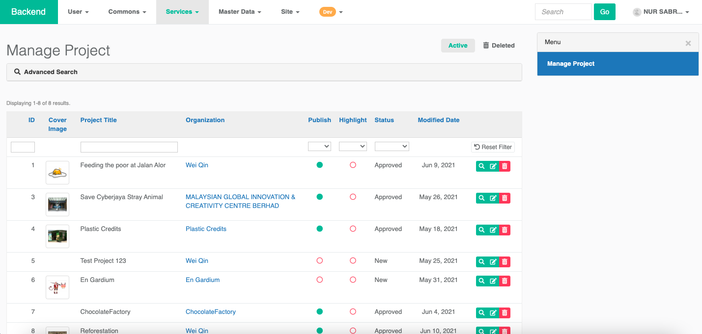

# SIX for Program owner

### Backend

MaGIC's Social innovation Exchange used `SIX` module as backend and its management interface can be accessible thru:

`Backend` -&gt; `Service` -&gt; `SIX` -&gt; `Manage`

### Workflow for Challenge \(Problem Statement\)

As an admin, you can perform the following workflow action onto a challenge submission by problem statement owner.

1. `new` - In draft mode, the applicant not yet submitted. Submission is editable by the application at this stage. 
2. `processing` - Processing by admin. Admin can post messages to the applicant for amendment. Submission is editable by the application at this stage. After amended, applicants can resubmit and have their status reset back to stage 2. 
3. `approved`  
   1. Application approved by admin.
   2. Auto-create participation form \(F7\) to take in solution provider submission for this challenge.
   3. The project is accessible in the frontend \(SIX website\).
4. `reject`- To mark this challenge as permanently rejected by Admin. 

### Workflow for Solution Provider

The entire workflow is handled by F7 Stage:

1. `application` - Submitted new application
2. `pending` - Pending for problem statement owner
3. `approved` - Proposed solution is approved by problem statement owner
4. `rejected` - Rejected by problem statement owner

An application can be edited under `draft` mode. Once submit in `submitted` status, application is not editable. However, before closing date, applicant can revert a submitted application back to `draft` for re-editing. 

### F7 Form Solution Provider Submission

You can manage all submission of a particular challenge by viewing the challenge.

#### &lt;&lt;&lt;need to put screencapture view&gt;&gt;&gt;

Click link under `Applicaiton` form and you will be brought to the F7 form page in backend.

All submissions \(`draft` and `submitted`\) can be found here. Click into each of them, to view and to update its workflow stage.

