# SIX for The Impact Driven Organisation

### Steps to get listed

1.  **Create a Project Page**

    Fill up a form to build an all-in-one page for people to know about your organisation, the project, and how they can reach out to you. When you are done click submit.
2.  **Submit for Review**

    MaGIC will review your project page and maybe get in touch to jazz it up. When your application is looking amazing we publish it.
3.  **Wait **

    Stand by to receive emails from funders and experts getting in touch to help you.&#x20;

### Create a project page

You need a Central user account to proceed. After login, you may post it either thru the MaGIC SIX main page or Member Control Panel.

### Method 1

#### Select existing or create new Organisation

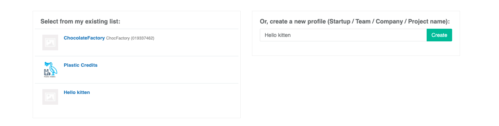

* Select an existing organisation of yours from the left
* Or, insert a name for your new organisation
* You may proceed to create the organisation profile if new
* If the organisation profile exists, you may request permission from its owner to join.

Upon completion, proceed to select the desired organisation and process to the next page&#x20;

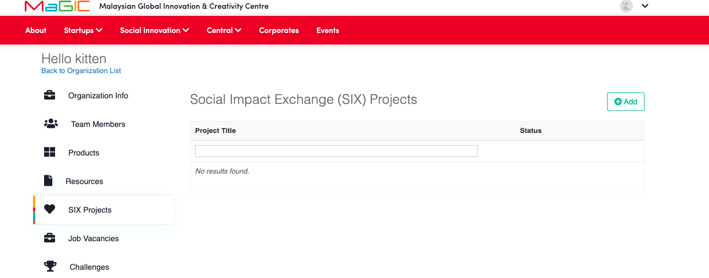

### Method 2

#### Select existing or create new Organisation


You will need an organisation profile to host a challenge. Create a new one or join an existing one to proceed.


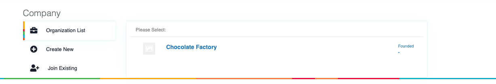

* Select an existing organisation of yours from the list
* You may proceed to create the organisation profile if new
* If the organisation profile exists, you may request permission from its owner to join by proceeding with the join existing option.

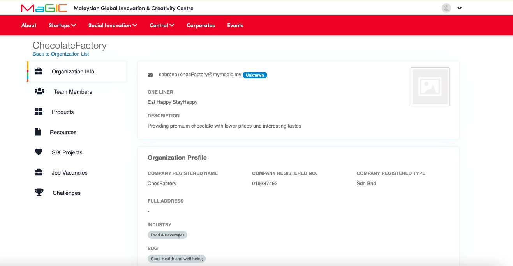


As a requirement to send status confirmation, **Company 's email** and **company name **must be filled to proceed.


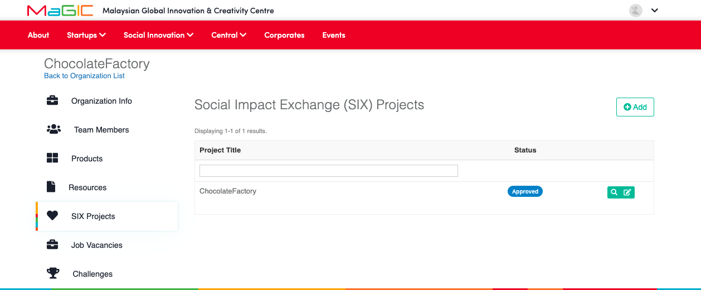

To start creating a project, click `Add` button on the top right of the page and you will be directed to a form.&#x20;

### Create a project

Click `Add` button and you will have to fill up a form to post:

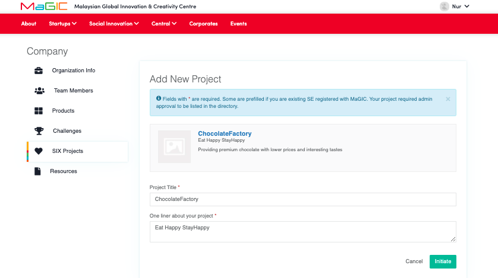

The information here is generally pre-filled, customized the information here as per need and click on the initiate button to proceed next page.&#x20;

Now, the Project has been created, Proceed to update the project information.

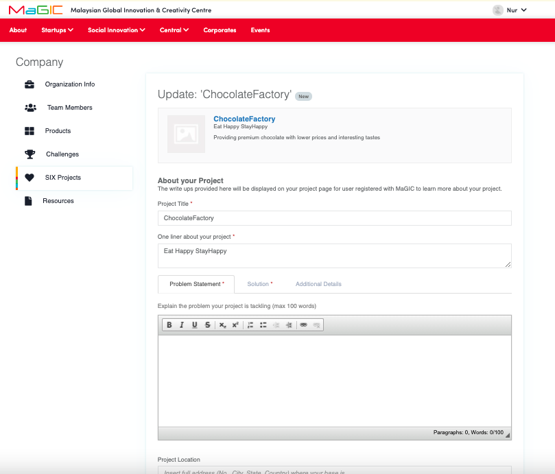

* All project information should be entered here.
* Supporting documents such as the impact report can be included in the 'Additional Details'  tab. Documents can be shared by pasting the links such as the Google drive link to be reviewed by the admin.

.png>)

* Each project has an open and close date. The ecommended timeframe between these two dates is not more than 6 months.&#x20;
* The project will be displayed on the website only once it is being approved by the admin
* Provide a cover and a header image to make your project stand out from the rest. Plain colour background use by default.
* Add photos on the 'add image' section so it can be displayed as a gallery on your project page.

### Submit a Project

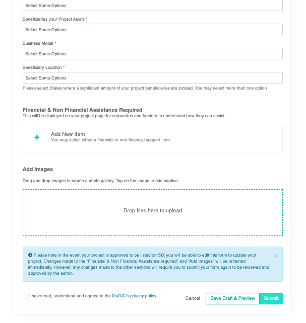

Once all the information has been entered,  click on `Save draft & preview` button to save it as a draft and preview the project page. This button will only appear on the first submission.

`Save draft & preview`will provide a display page on how the project will be shown on the website.&#x20;

There is an edit button on the`Save draft & preview`page if you want to edit first before you finalize the form.

Once everything is done,  Click`Submit` button and your application will be sent for approval by the admin. A notification email will be sent to your user account.

### Preview Project

Once submitted, you can preview your Project at Member Control Panel while waiting for admin approval for listing.

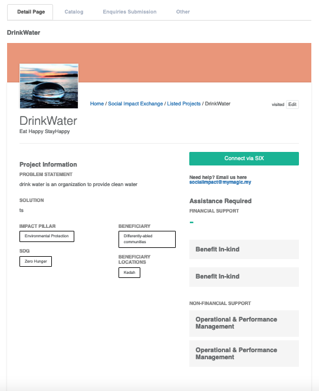

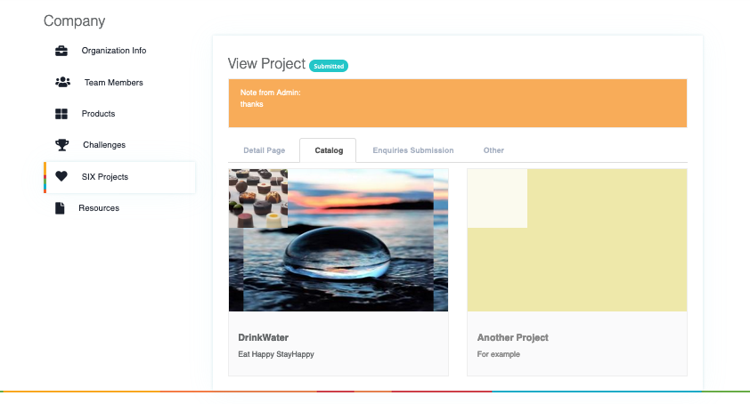

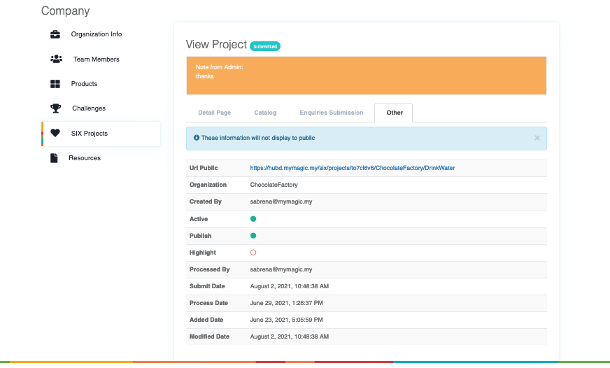

### Getting Approval & Featured

It's solely MaGIC Program Owner or Admin's decision to approve, process, or reject a project.&#x20;

If the admin reviewed your project and anything needs to be replaced, the admin will change your project status to processing and update you on the fields that need to be changed/ added accordingly.

Only during processing status, you are allowed to edit your information.&#x20;

If you are to edit the application after approval, you need to contact the admin to request to edit, so they will change your status to processing to allow changes. This process will need to go through reviewing by the admin again.&#x20;

### Receiving application from Solution Provider

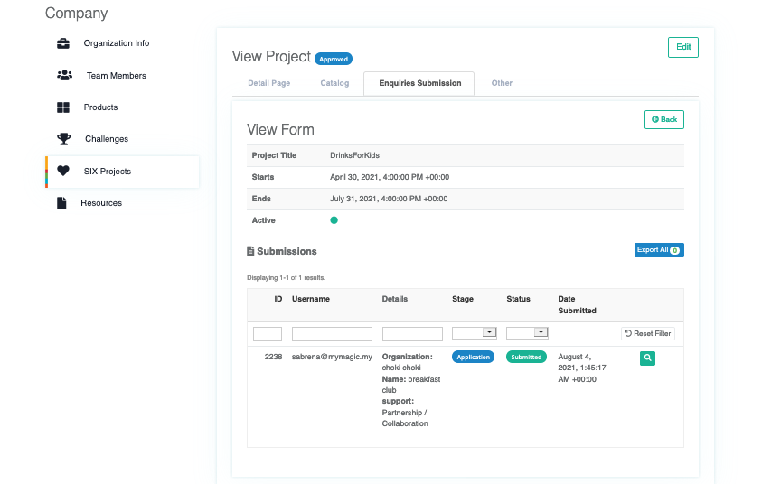

On the CPanel of the company, you will receive a filled application form by the corporate filled at SIX project website on the CPanel (Enquiries submission tab).&#x20;

You can click the `View Icon` in green to view more details of the form.&#x20;

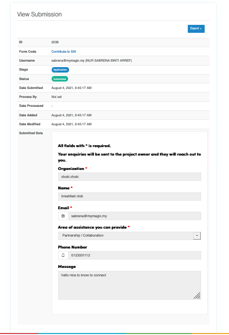

You can view the copy of the form filled by the corporate with all the details. The corporate can be contacted directly through the contact information given in the form.&#x20;

