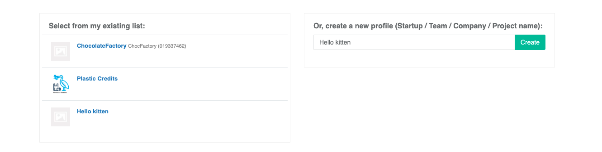
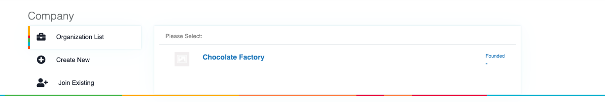
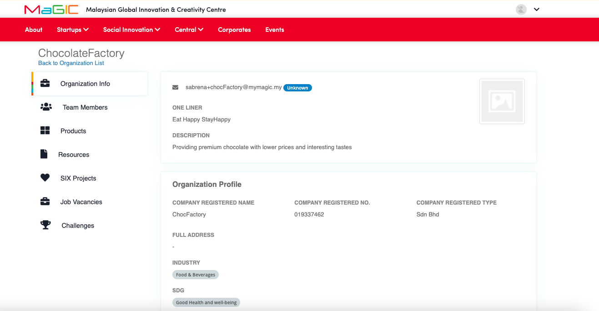
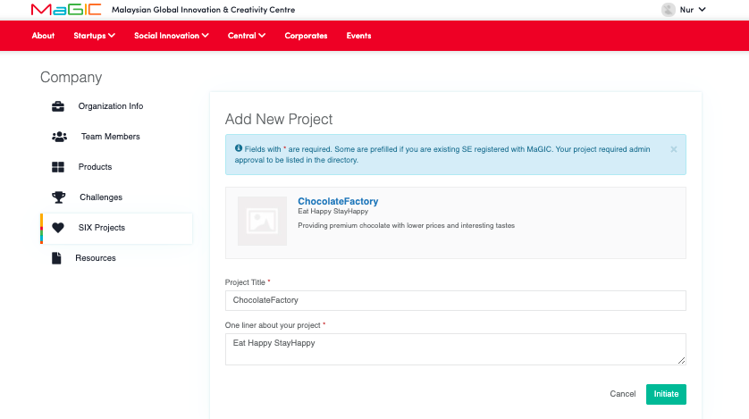
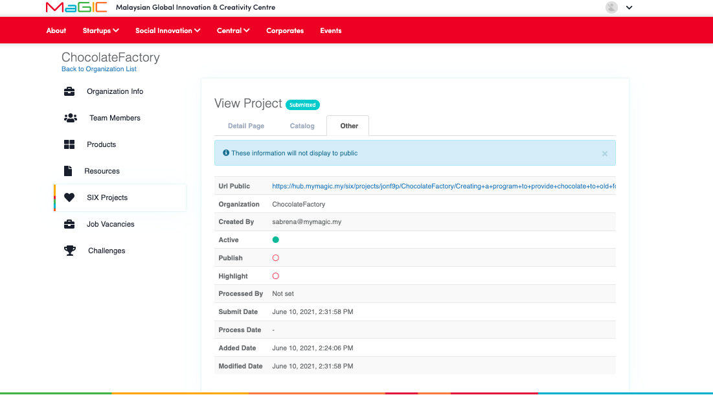

# SIX for The Impact Driven Organisation

### Steps to get listed

1. **Create a Project Page**

   Fill up a form to build an all-in-one page for people to know about your organization, the project, and how they can reach out to you. When you are done click submit.

2. **Submit for Review**

   MaGIC will review your project page and maybe get in touch to jazz it up. When your application is looking amazing we publish it.

3. **Wait** 

   Stand by to receive emails from funders and experts getting in touch to help you. 

### Create a project page

You need a Central user account to proceed. After login, you may post it either thru the MaGIC SIX main page or Member Control Panel.

### Method 1

#### Select existing or create new Organisation

* Select an existing organization of yours from the left
* Or, insert a name for your new organization
* You may proceed to create the organization profile if new
* If the organization profile exists, you may request permission from its owner to join.

Upon completion, proceed to select the desired organization and process to the next page 

### Method 2

#### Select existing or create new Organisation


You will need an organization profile to host a challenge. Create a new or join an existing one to proceed.


* Select an existing organization of yours from the list
* You may proceed to create the organization profile if new
* If the organization profile exist, you may request for the permission from its owner to join by proceed with the join existing option.

Click `Add` button and you will directed to a form

### Create a project

Click `Add` button and you will have to fill up a form to post:

Once the information is entered, click on the initiate button to next page.

* Each project has an open and close date. Recommended timeframe between these two dates is not more than 6 months.
* Provide a cover and a header image to make your project stand out from the rest. Plain color background use by default.

### Submit a Project

Click on `Save draft & preview` button to save it as draft and preview the project page. This button will only appear on first submittion.

Click `Submit` button and your application will be sent for approval by admin. An notification email will be sent to your user account.

### Preview Project

Once submitted, you can preview your Project at Member Control Panel while waiting for admin approval for listing.

### Getting Approval & Featured

It's solely MaGIC Program Owner or Admin decision to approve, process or reject a project.

### Receiving application from Solution Provider


Function will be confirmed


IDO will receive a filled application form by the corporate filled at SIX project website. 

