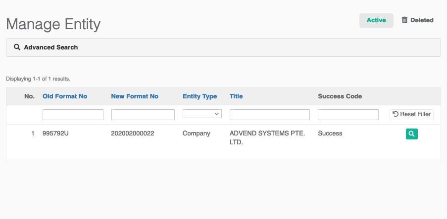

# SSM Integration

SSM Integration is a module that allows Central to purchase the Company or Business profile direct from the SSM database through their appointed Service Provider. For now, this integration only cater for:

* Company
* Business


Company type consist of Company Limited by Guarantee \(CLBG\), Private Limited Company \(Sdn Bhd\), Public Limited Company \(Berhad\), and Foreign Company



Business type consist of Sole Proprietorship and Partnership


Once we have requested the profile, we will received raw data \(JSON format\) & readable document \(PDF format\) as the result for each successful request.


Request for particular company/business profile will check the setting that we have set \(e.g: 7 days\). If it is within the range, it will find the latest successful request profile in our database. Otherwise the request will go through the SSM API to get fresh data and update into our database.


## Entity

There will be a list of entities \(organizations\) that have been used to check with the SSM Integration. Any successful request will show `Success` in the `Success Code` column. On the other hand, it will show `Failed` \(with some error message\) for those that was not found in the SSM Database.

To view the entity, just click on the icon . To know when the last date for that particular entity was requested, you can check the `Modified Date` . To download the certificate, just click on the link uploaded file in `Registration File` field.

## Check Entity

To check or request new data from SSM, simply click on the `Check Entity` menu. You will be redirected to this page.

What you need is just a company/business registration number to be put in `Entity Number` field. The `Title` is an optional field. If the request is success, it will automatically update the `Title` based on the result received.

