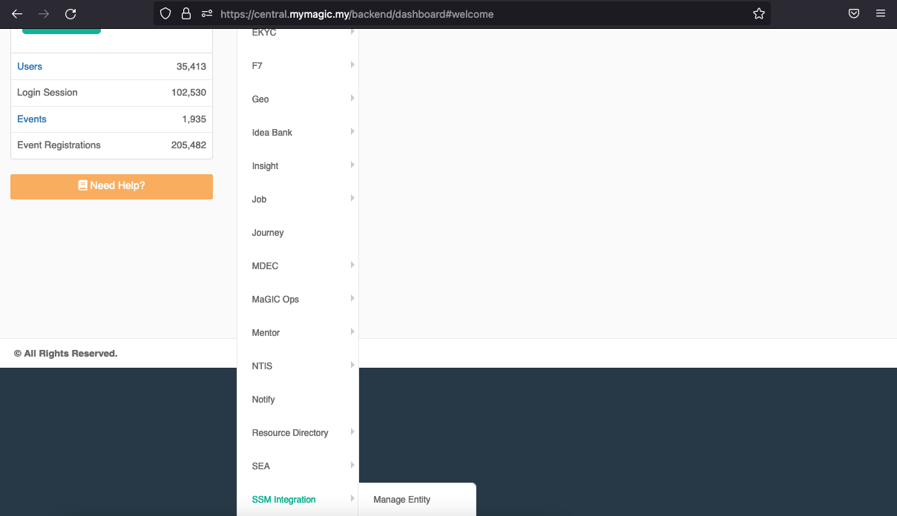
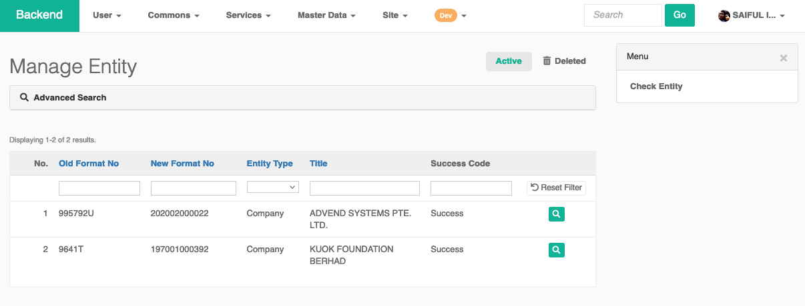
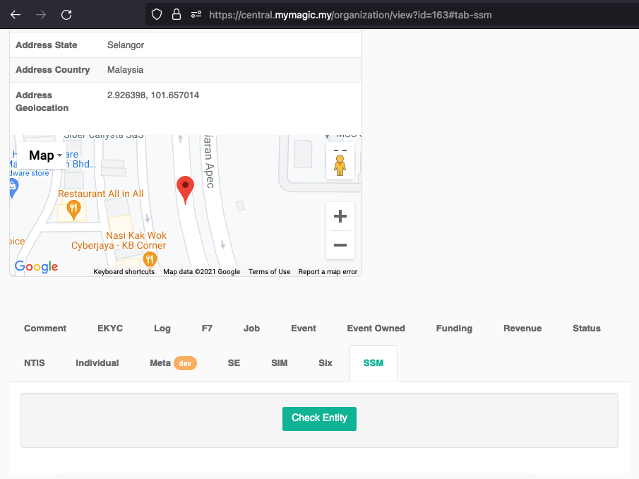
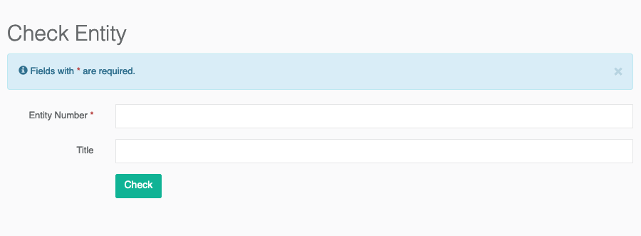

# Check Entity

## How to get here


Not all user will allow to do this action


You can access this page by navigate the main menu to `Services` &gt; `SSM Integration` &gt; `Manage Entity` . 

Once you have land to the page you should see the `Check Entity` menu on the right side of the page.

Alternatively, you could find the `SSM` tab, when you view details for particular `Organization` 

## Check Entity

What you need is just a company/business registration number to be put in `Entity Number` field. The `Title` is an optional field. If the request is success, it will automatically update the `Title` based on the return result.

Basically this function will purchase the company/business profile through the API. Each success request will cost us about RM15.30 \(including service tax\).


If you caught for misuse this service, you will be facing some punishment.


