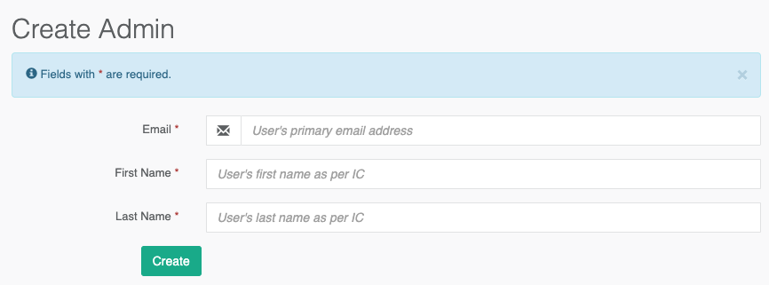

# Admin

### Manage Admin

`User` \ `Admin`

This interface list all active and inactive admin in the system. Click into each individual record to view the details.

### View Admin

Here you get a detail view of the selected admin user. You may block \ deactivate \ soft delete an admin here. You can also trigger which role this admin account has access to.

### Create Admin

Admin account can be created from backend. Behind the scene, the system first create the user, profile and member record in database; then, proceed with admin record creation. 


Do not forget to assign role to the created admin account. Minimally, it required the `admin` role assigned in order to access the backend.


### Assign Roles

Admin is given a specific access to the backend functionality thru the role \(group of access\) they assigned to.

### Reset Password

As Central is using MaGIC Account as SSO provider, password reset need to be done in MaGIC Account backend.

### Delete Admin Account

Admin can soft delete another admin from the backend. This is same to clicking `Block` button in the admin view page. Deleted admin has their account status set to `inactive`. An inactive or deleted account can be restore back to normal later on.

Behind the scene, system perform identical action of `Delete a member` . Deleted admin will not be able to access the member functionality in frontend and cpanel as well.


There is no way to deactivate the admin account only without deactivate its corresponding member user. However, you may remove all roles given to an admin to achieve what you intended to do. 


