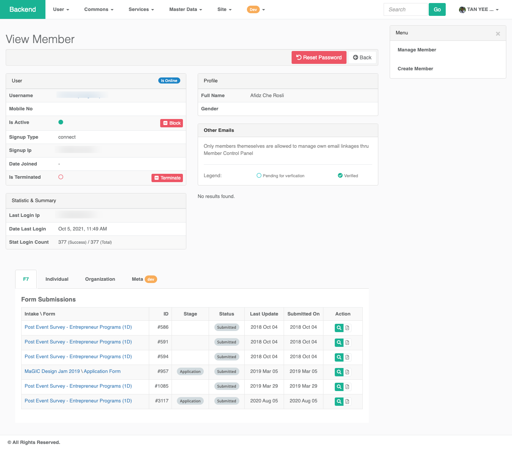

# Member

### Manage Members

`User` \ `Member`

This interface list all active and inactive members in the system. Click into each individual record to view the details.

### View member

Here you get a detail view of the selected member user. You may block \ deactivate \ soft delete a member here. You may also choose to `terminate` a member user account. 

### Create member

As admin, you can create member account from backend. However, this is not recommended. Member should create their own account from the frontend going thru all the designed workflow to ensure data integrity. 

### **Reset Password**

As Central is using MaGIC Account as SSO provider, password reset need to be done in MaGIC Account backend.

### Delete a member

Admin can soft delete a member from the backend. This is the same to clicking `Block` button in the member view page. Deleted member has their account status set to `inactive`. An inactive or deleted account can be restore back to normal later on.

### Terminate a member


Unlike \`delete a member\`, this action is not reversible


Member termination can come from User himself or Admin. Once confirmed, it will:

1. Soft delete the member user account on Central
2. Call `/api/terminateAccount`to instruct MaGIC Account to delete
3. Create a request record with code `removeUserAccount` with `pending` status
4. Create a request record to generate user data download
5. Unsubscribe user from mailchimp
6. Notify the user his account has been successfully terminated

