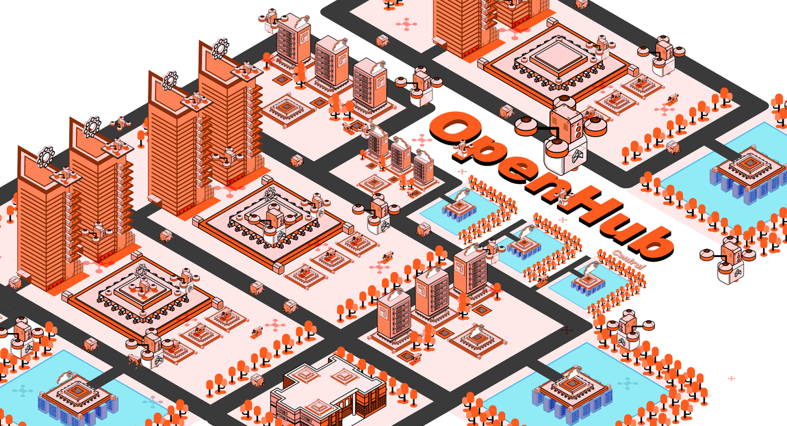

# OpenHub

OpenHub is an **open source** version of MaGIC CENTRAL, available for **FREE** for all MaGIC-like ecosystem developers at different geo location.&#x20;

We hope thru this open source initiative, MaGIC-like ecosystem developers can come together and build a shared digital platform where everybody can be benefited from it.



### Calling all Ecosystem Developers



### Technical Details

This open source project is under BSD-3-Clause License. As a software project, contributors are expected to have programming skillset and willing to get hands dirty with coding. MaGIC has no obligation to provide any supports to this initiative.

* Familiar with GIT, Sub GIT module, Docker & Mac shell script
* LAMP (Ubuntu, Apache2, MariaDb, PHP)
* Yii framework (version 1)
* HTTPS  & SSL required
* Hosted on the cloud (AWS)
* Plug-and-play modular architecture&#x20;
* Not all modules are open source (exclude MaGIC specific modules)
* Data too is excluded (Open Source != Open Data)

OpenHub has its own [documentation for developer](https://github.com/mymagic/open\_hub/wiki) hosted on Github.

