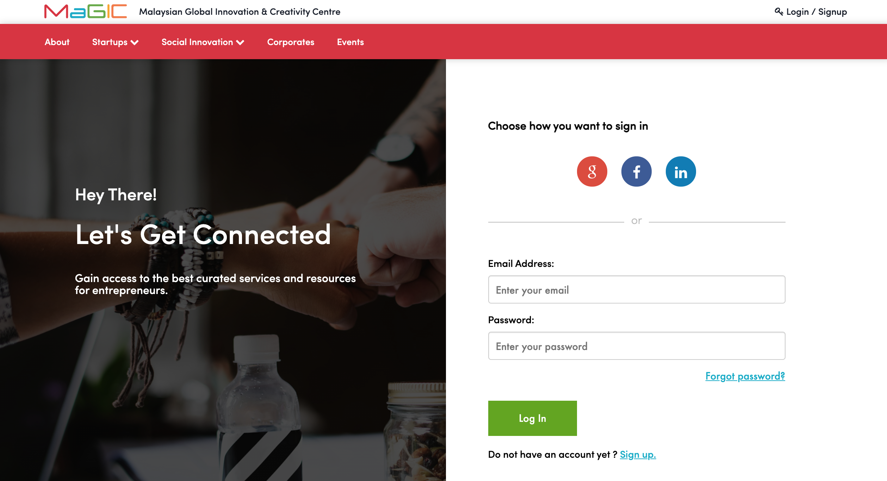
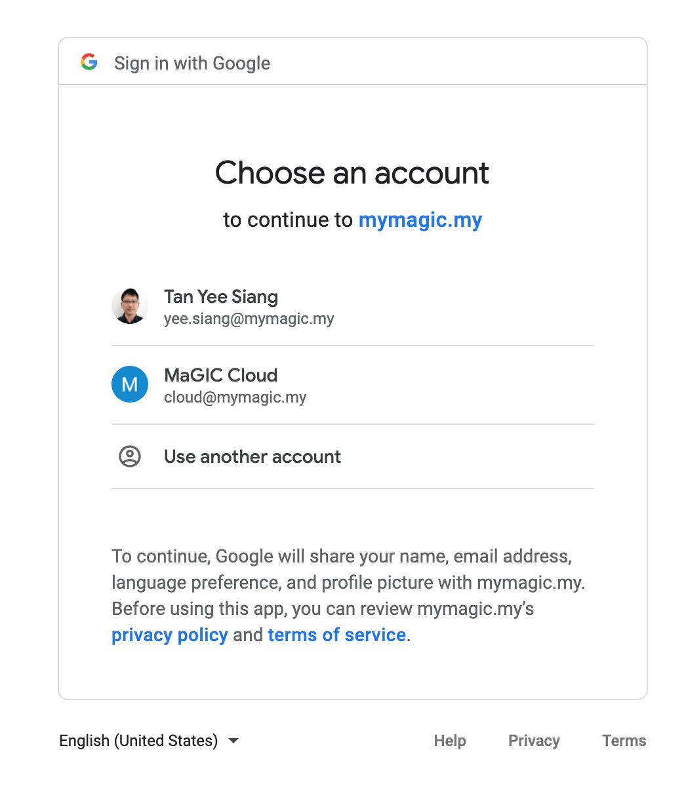
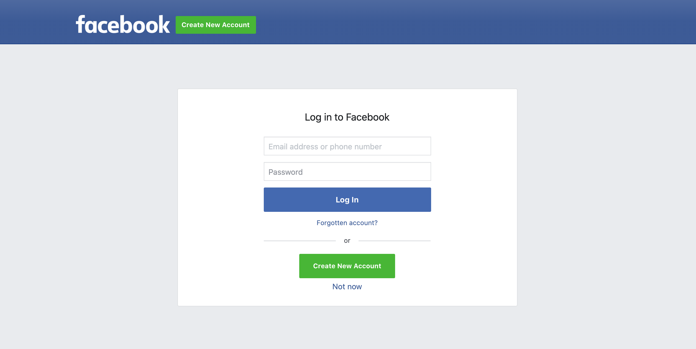
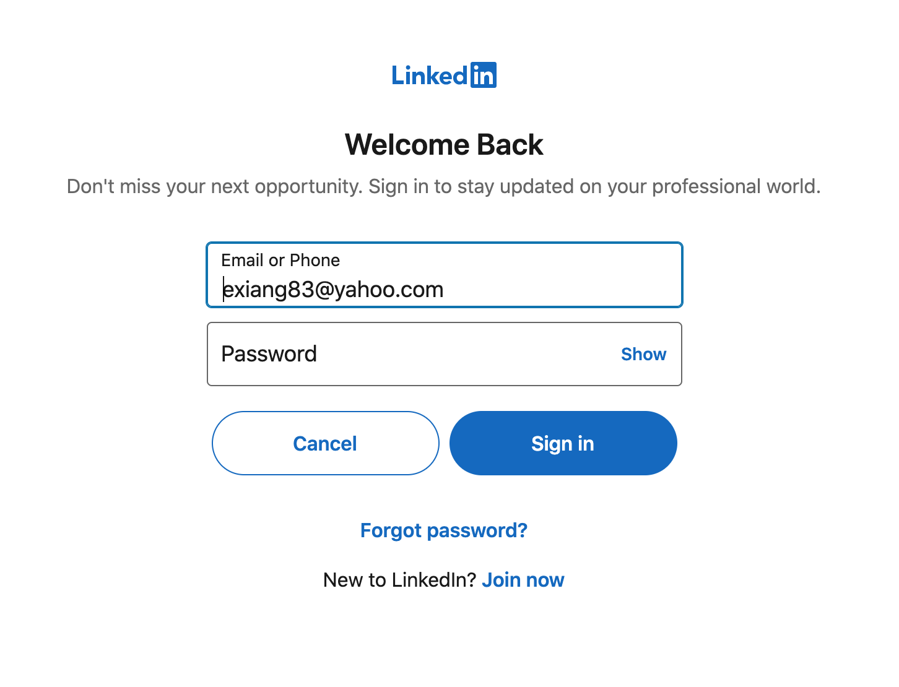
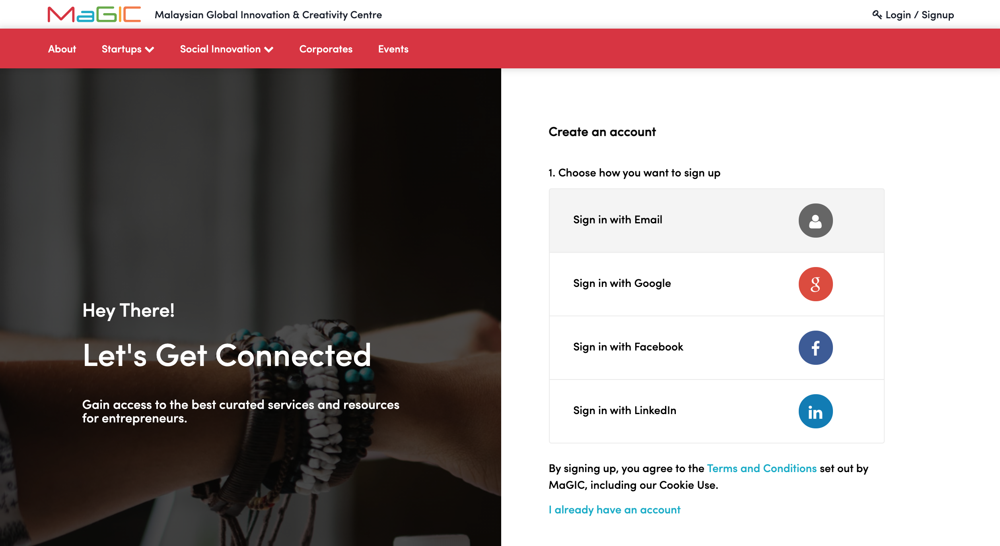
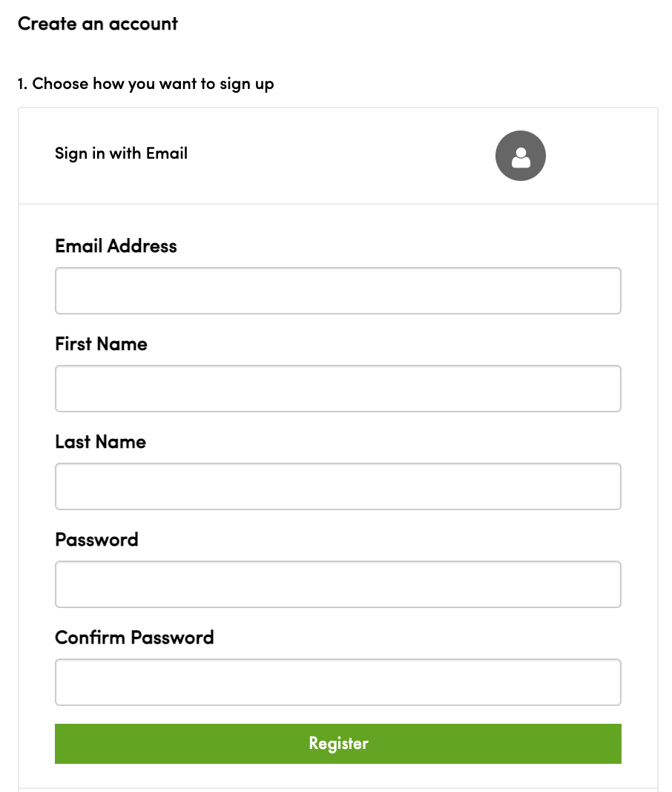
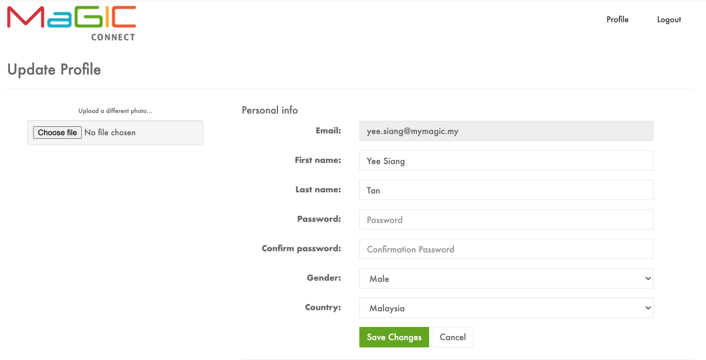
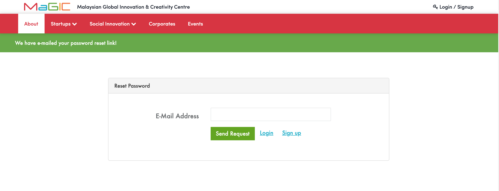
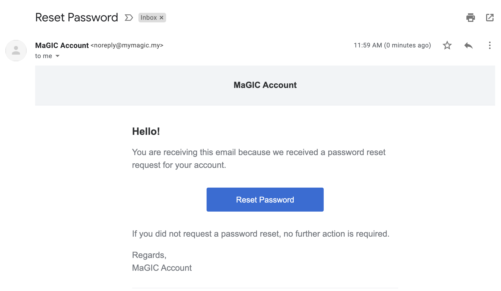
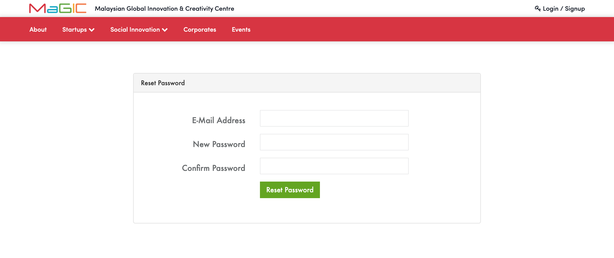

# MaGIC Account

### Single Sign On

MaGIC Central is connected with MaGIC Account ([https://account.mymagic.my](https://account.mymagic.my), aka MaGIC Connect) for its single-sign-on feature, allowing multiple applications developed within our ecosystem to connect with one single user account.&#x20;

As new user, you may choose either **one-click social media instant login **(recommended, no sign-up required); or sign-up and login through traditional method.

Accounts are tied to a unique email address and requires verification to access the system.

### Social Media Instant Login

This is the recommended way to gain access into the system. No sign-up stage is required as your social media provider is a trusted source of identification.

MaGIC Account support 3 social medias: Facebook, Google & Linkedin.

#### Google Login

If you have multiple accounts login on google, the following prompt will appear for you to select which account you wish to use.&#x20;

Next, Google will ask for your permission to allow MaGIC Account to retrieve several required information from your Google Account. Approve to proceed.

#### Facebook Login

#### Linkedin Login

### Traditional Signup and Login

We keep this old but working method to support users who do not have the above social media account (e.g. Government servant).

1. Under the `Login` button, click "**Do not have an account yet ? Sign up."**
2. Click "**Sign in with Email**"
3. Insert all required information and click "**Register**"
4. Verification email will be sent to the above email address. Please follow the instruction in it to help us verify your email address. Failure to do so will not grant you access to this system.&#x20;


Please check your spam box if you failed to receive the verification email. This email is automatically sent when you register and should not take more than 1 hour to reach your mailbox. &#x20;


### After Login

Upon successful login, you may be redirected to:

* Update Profile page in MaGIC Account
* MaGIC Central Member Control Panel
* A preset URL to continue your action before this

### Logout

Logging out from the system is as easy as clicking your avatar on the header bar and select "**Logout**".

Please note for better security, the system will automatically log you out once it detects an idle session.&#x20;

### Forgot Password

In case you have lost your password, you may retrieve it back by clicking the "**Forgot Password**" link on login page.

1. Fill in the Reset Password form with your email address and click **Send Request** button,

2\. An email will be automatically sent to your mailbox. Follow the instruction and click "**Reset Password**" button.&#x20;

Repeat step 1 if you did not receive this email within an hour to have the system resend a new email.

3\. The link will direct you to this **Reset Password** page. Insert the same email address but new password to proceed.

Upon successful reset, you will be redirected to "Central Member Control Panel".

