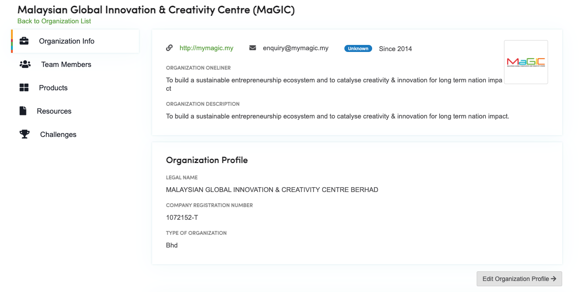
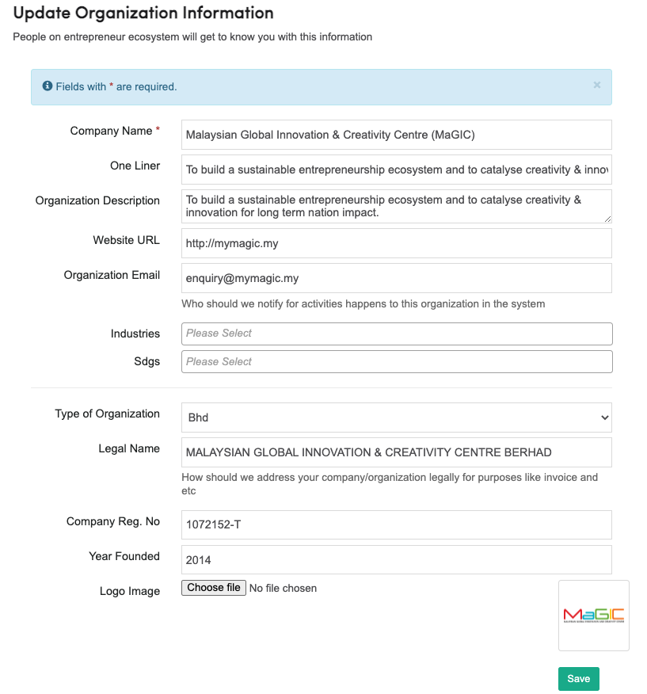

# Manage My Organizations

### Create Organizations

You may create a new organization profile if it does not exists in CENTRAL yet. Or, you may join an existing organization profile.

### Update Organization


Don't be surprised if you are unable to locate the update button and modify an organization through the Member Control Panel. Your access to modification features may have been removed by admin for various reasons:

* You are creating multiple duplicate profiles of the same company
* We had improved your organization's details and prefer that it is locked temporarily, free from unexpected update.


While you are inside organization profile, click `Edit Organization Profile` button

### How it link with F7 Form and other modules

Your organization profile is reusable for other services on MaGIC Central. For example, startups can apply for MaGIC programs using [F7 form](../../by-modules/f7-form/) service by using their existing organization's profile through the selection list.

1. Saves time of applicant from reinserting the same information over and over again
2. Prevents duplication of entries
3. Makes data cleaning job easier as we are referring to the organization using ID instead of name variants.

