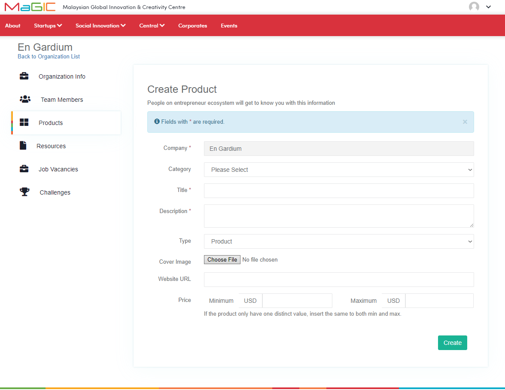

# Manage Organization's Products

### Adding Organization's Products

You can add your organization's products as well after you have successfully created your organization in Central.

Firstly, navigate to the Products page from your organization profile page. Referring to the above diagram 1, you can see that there is an `Add`button on the right hand side of the page. Click this button to add a new product to your list of products. Clicking the button will open up a form as shown below in diagram 2.

After filling in the form with the necessary details, simply click the create button on the bottom right side of the page and your product is successfully created! You will be redirected to a page displaying your product information as below 

### Edit Organization's Product 

On the same products page, you can also edit your product's information as well as view them again.

As you can see in the diagram above, there is a product called "Concept Art". Along the same line of "Concept Art", there are two different buttons. The `magnifying glass` is the button that will lead you to the product's info page which you can see in diagram 3. The button next to the magnifying glass is the button that allows you to edit your product's information. This can also be done in product info page by clicking on the `Edit Product Information` button on the bottom right side of the page as seen in diagram 3.

A form as shown in diagram 5 will be displayed and you are free to edit whichever information regarding the product as you wish. When you are done, remember to click the `Save` button on the bottom right of the page.

