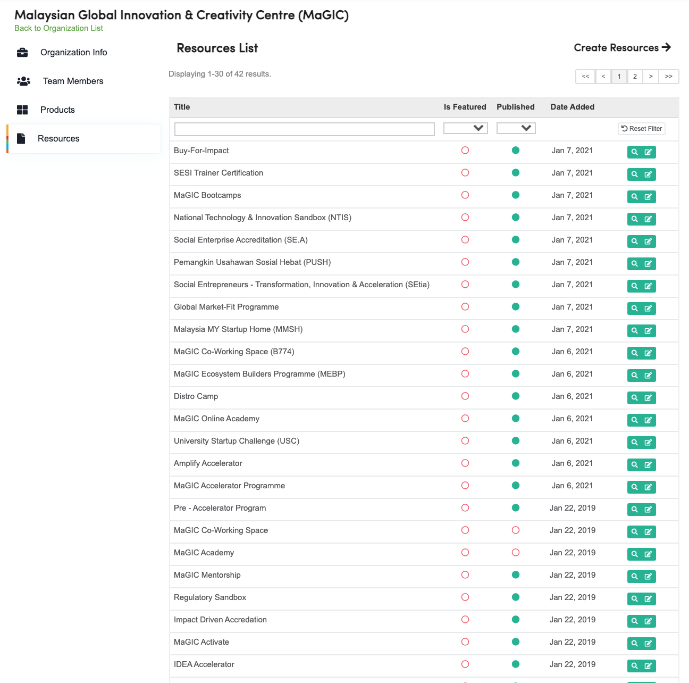
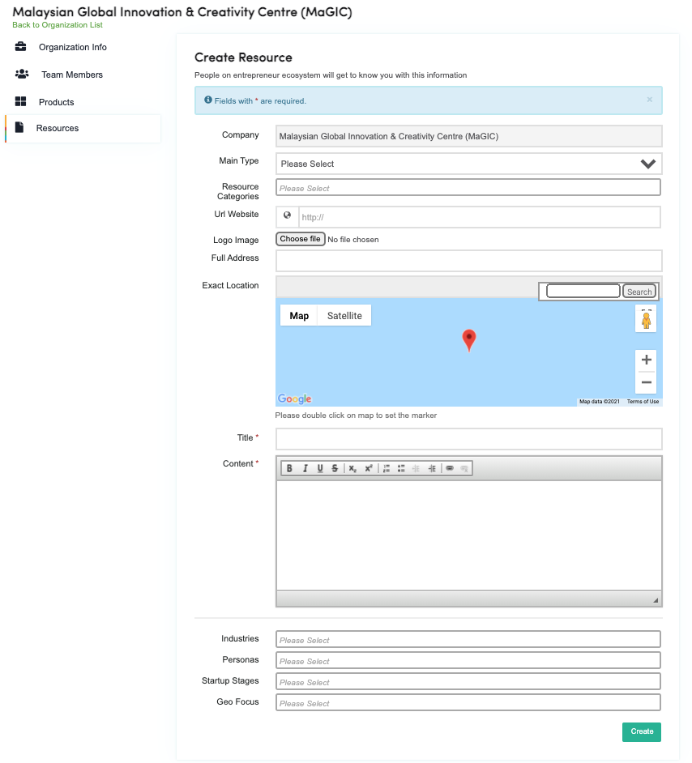
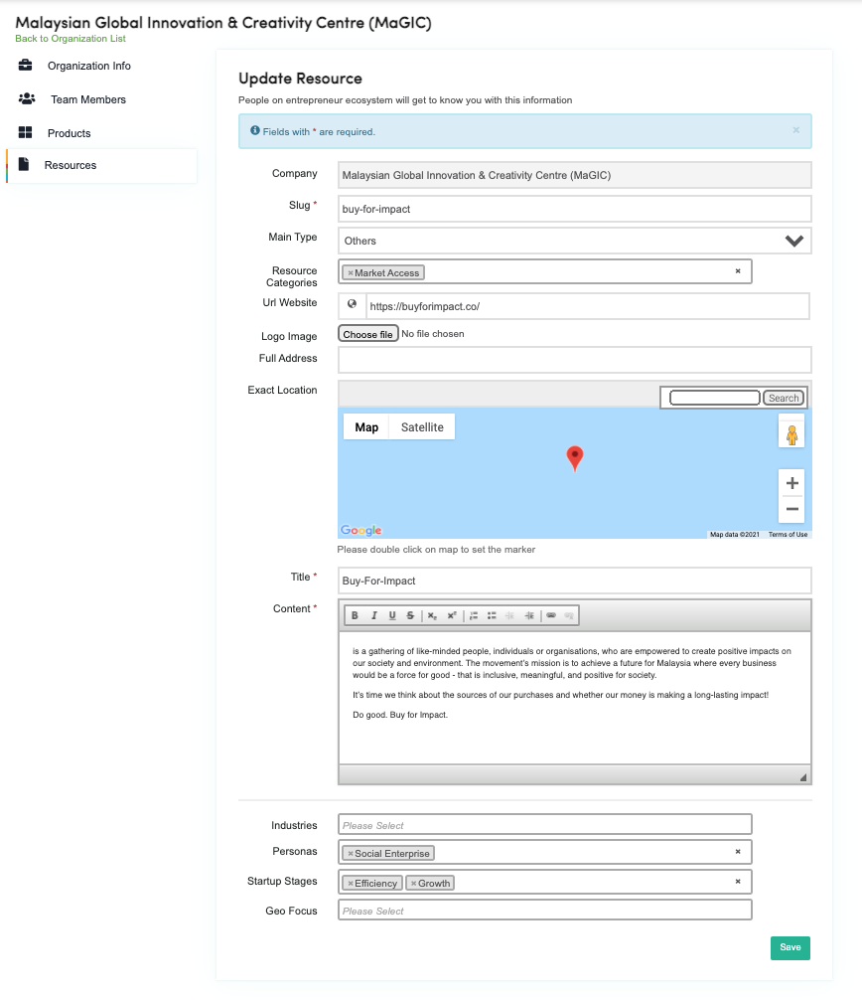
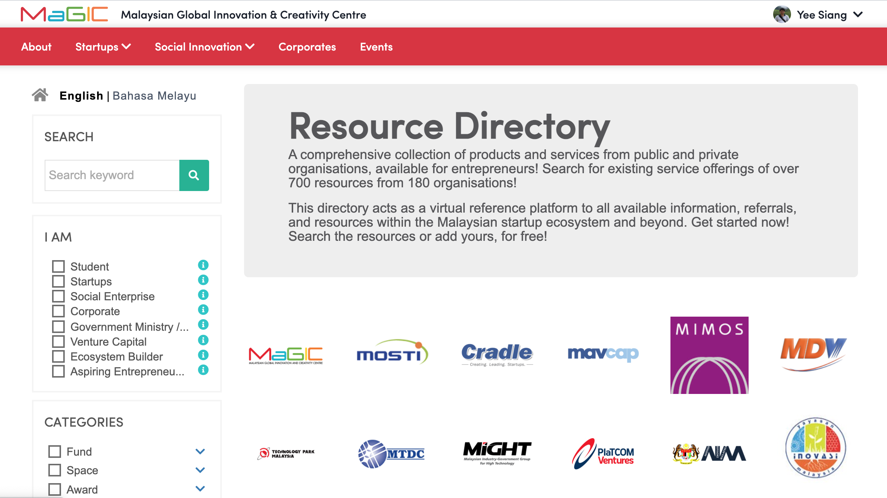

# Manage Organisation's Resources

Resources are attach to an organisation. To manage or add a new one, you must first select an organisation to start with.

### List Resources

### Create Resources

Once submitted, Central Admin will respond with a decision of either Approve / Reject the submission.

Approved Submission will be automatically publish onto Central Resource frontend.  

### Update Resources

1. Goto `Member Cpanel dashboard`
2. Click `My Organizations` to select an organisation from the list
3. Click `Resources` from the side menu
4. Click `Edit` button on the resource to update from the list of resources
5. Click `Save` button once you done editing. Your changes will automatically published onto the frontend without the need for admin approval.

### Resource Frontend

