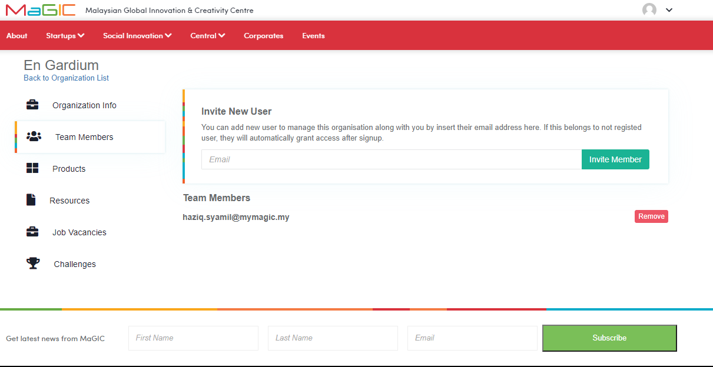

# Manage Team Members

### **Invite Team Members**

After creating your organization in MaGIC Central, you can add your team members to manage your organization on Central. 

First of all, simply navigate to the Team Members page from your organization profile by clicking on the `Team Members` button below `Organization Info`. Once there, you can add or invite your team member by entering their email. They will get a link, that allows them to become a member

### Manage Team Members

On the same page, you can also manage your team members as you have the option to remove them as you can see in diagram 1.

