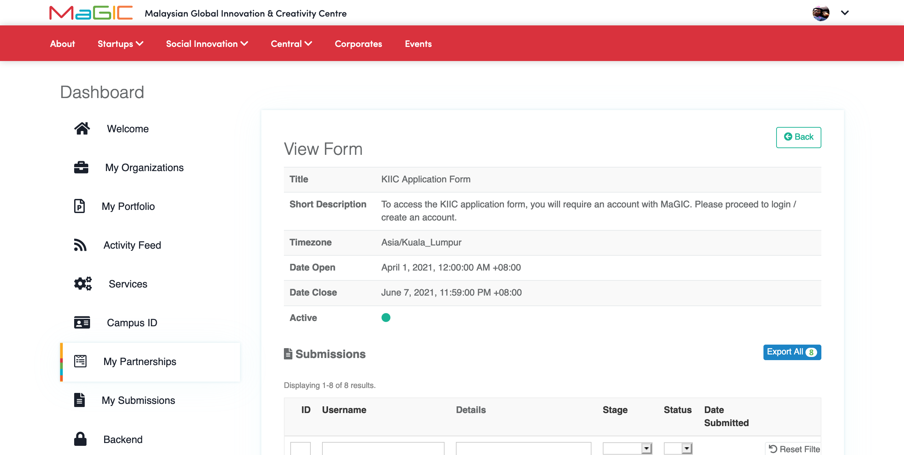
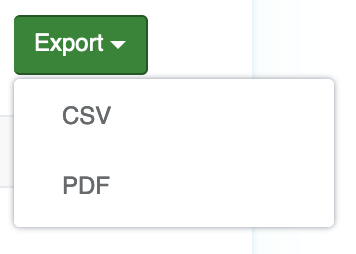
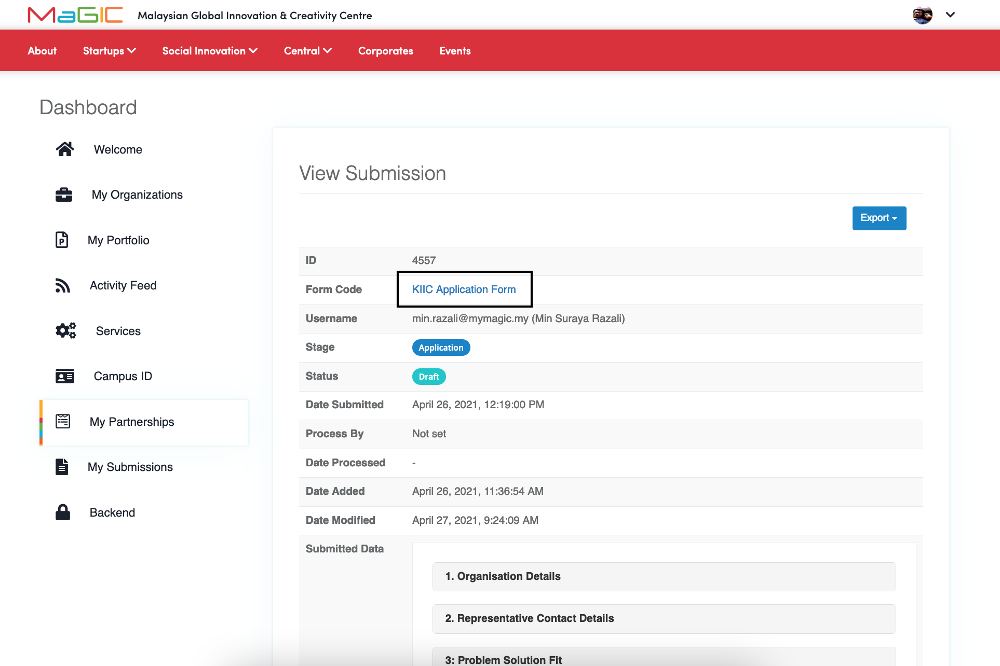

# Manage My Partnerships

You will be redirected to this [**Dashboard**](https://central.mymagic.my/cpanel) page after you have successfully logged-in to our [**Central**](https://central.mymagic.my). You will see the Menu `My Partnerships` only if your email has been assigned to any Form.

You will see the above screen once you have clicked on `My Partnerships` menu. Your forms will be listed and sorted  by latest `Date Open` by default. You might get the basic information from the list such as when it was opened/closed to the user and you can get to know the number of submissions and in draft mode.

You can filter the list by `ID` and `Title` if you want to. To reset the filter, you can click on  `Reset Filter` button. Once you have decided which `Form`, you can click on the `View`  buttonto view the Submissions List for that `Form`.

You will see the above screen if you go to that particular form. Here, you can filtering the list by `ID`,  `Username`, `Details`, `Stage` and `Status`. To reset the filter, you can click on  `Reset Filter` button. Once you have decided which `Submission` you want to view, you can click on the `View`  button to view the details. To go back to the list of your Form, click on `Back` button  

The submission can be exported into 2 formats which are `CSV` and `PDF` by clicking on `Export` button  .

To go back to the Submissions List, you can click on the `Form Code`, the screen will redirect to the previous view.

