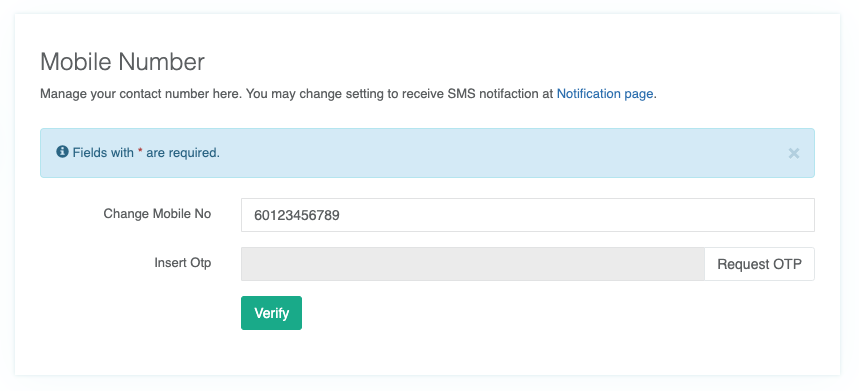

# Manage My Profile

### Profile in Settings


If you already verified your indentity with EKYC, the system will disable updates to your name, gender and country.


You may update your individual details here, such as:

* Full name
* Gender
* Profile Picture \(avatar\)
* Country
* Persona \(multiple allowed\) - what's your other role?

### Other Emails

We understand our users have multiple email addresses and may use different ones to register with our programs and events. Now, you can link your other email addresses to one account in order to consolidate activities registered.

A verification email will be sent to the respective email after being added. Please make sure you you click the `Approval link` to complete the process.

### Mobile Number

You can register your mobile number into the system. You may change setting to receive SMS notification at `Notification` page.

Click `Request OTP` after inserted your mobile number. A short verification code will be sent to this number of yours thru SMS. Insert it here and click `Verify` button to complete the process.

### Notifications

All MaGIC Mailchimp newsletters are listed here for you to DIY manage newsletter subscriptions.

* You are free to subscribe / unsubscribe to any public and private newsletter
* Private newsletters are displayed, provided your email is tied to it by program owner
* You are not allowed to subscribe to any private newsletter of which you were not invited

If you had registered mobile number with the system, you can set to receive SMS notification or not at this interface.

### Download Account Information


This page has been temporary disabled by Admin


You may **Terminate your account** from a link found at bottom of this page. Please note this action is irreversible and we will not be able to recover your account after this.

### Manage Interest

Help us serve you better by updating your interests to get better program and service recommendations. 

CENTRAL asks for your interests upon your first login to Member Control Panel. Here is where you can update the data if you missed it.

We ask for:

* Industry
* SDG
* Startup Stages

### Two-Factor Authentication \(2FA\)

Two-factor authentication \(2FA\) improves account security by requiring a second piece of information to validate your identity when logging in.


Highly recommend all admin user to strenghten security for their account by enable two-factor authentication.


Click `Enable 2FA` button to start the setup process.

Follow the instruction here and click `Next` to complete the setup. Once 2FA is enabled, you will be prompt to insert the verification code in the next screen and your subsequence login.

You may disable this anytime by clicking `Disable 2FA`.

