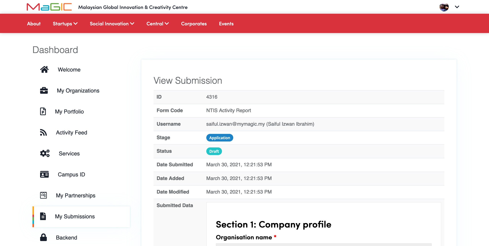

# Manage My Submissions

You will be redirected to this [**Dashboard**](https://central.mymagic.my/cpanel) page after you have successfully logged-in to our [**Central**](https://central.mymagic.my). You will see the Menu `My Submissions` only if you have submitted any form using your logged in email.

You will see the above screen once you have clicked on `My Submissions` menu. Your submissions will be listed and sorted  by latest `ID` by default. You might get the basic information from the list such as what form you have been submitted, when it was closed and the current status .

You might want to filter by `ID` to find specific submission. To reset the filter, you can click on  `Reset Filter` button. Once you have decided which `Submission` you want to view,  you can click on the `View`  button. 

You also can click `Update` button  if applicable \(`Status` is in Draft and not later than `Date Close`\) and complete the form before proceeding for the Submission.

