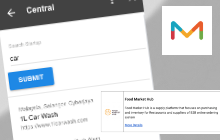
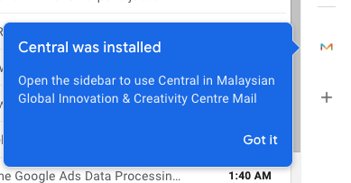
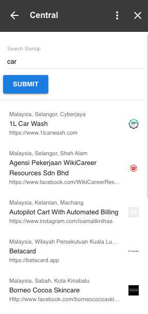
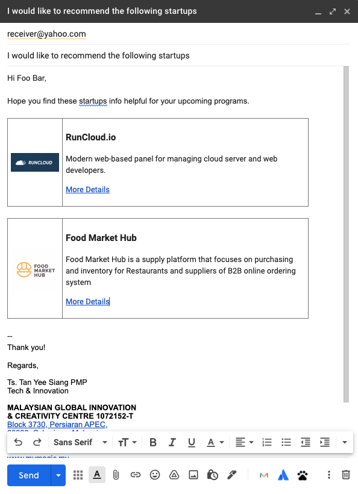
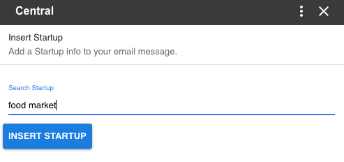
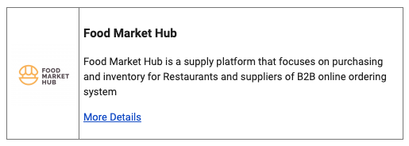

# Central App for Google

Central App is an Google add-on developed by the MaGIC Tech team for the use of MaGICian, allow alumni search in Gmail and attach startup info into email content when drafting.

### Enable it in Gmail

Firstly, login to Gmail using email ended with the organization domain \(e.g. xxx@mymagic.my\). This app only works within the application scope.

![Click the \[+\] icon in add-on bar found at right hand side of screen](../.gitbook/assets/screenshot-2021-09-22-at-3.22.05-pm.png)

![Add-on Marketplace popup. Click on the \[=\] on top left, look for \`mymagic.my apps\` at the end of list](../.gitbook/assets/screenshot-2021-09-22-at-3.22.20-pm.png)

### Using the add-on in Gmail

#### Search for Alumni

Startup Alumni info can be easily search thru the add on. just type the related keyword and list with matching name will displayed. Click on the item would brought you to the startup detail page hosted at [https://central.mymagic.my/network](https://central.mymagic.my/network)

#### Insert Startup Info to email

Open the add-on when composing an email will enable this function to search and attach startup information into email content.This include the startup name and logo, one liner and link to its detail page at Central Network.

