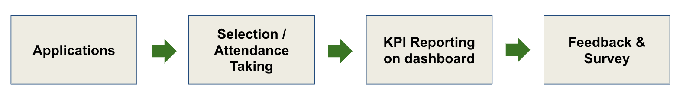

# End-to-end Automation

Central facilitates your programs and events from the application stage, selection stage, and up to KPI reporting stage. The main goal is to reduce human intervention in the process to ensure data integrity and to promote transparency.



### How it works

Central tracks all activities happening in the organization**.** Regardless it's an one-off event like fireside chat, online/offline sharing session, workshop or series of events like **Grill-or-chill**, **USC**, various **bootcamps** and **accelerator p**rograms, and etc; they are all recorded into the system as an **event**.

An event has the following basic attributes:

* Title
* Start & End Date
* Who are the individuals that participated \(registration & attendance\)
* Who are the organizations that participated \(registration & attendance\)
* Who are the organizer / owner / sponsor / partner
* Event for which industry, persona, SDG, etc.

### Selecting the software method

#### Eventbrite

* Suitable for events/webinar
* Use for events targeting individual participant \(not company\).
* Support both free or paid event
* No selection process on participant
* Program Owner can DIY create event on Eventbrite \(using provided sample event\)
* Program Owner must take attendance using Eventbrite App for event manager
* Already preset to auto sync data back to Central
* Takes 1-3 days to create an event

