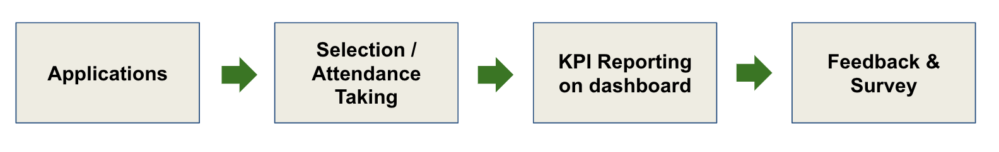

# End-to-end Automation

CENTRAL facilitates your programs and events from the application stage, selection stage, KPI reporting and up to post-event survey stage. The main goal is to reduce human intervention in the process to ensure data integrity and to promote transparency.


MaGIC Central (Events & F7) for program owner


### How it works

CENTRAL tracks all activities happening in the organization**. **Regardless if it's a one-off event like fireside chat, online/offline sharing session, workshop; or a series of events like **Grill-or-chill**, **USC**, various **bootcamps **and** accelerator p**rograms, and etc; they are all recorded into the system as an **event**.


KPI Dashboard and Survey only work when data is captured in CENTRAL event.


An event has the following basic attributes:

* Title
* Start & End Date
* Who are the individuals that participated (registration & attendance)
* Who are the organizations that participated (registration & attendance)
* Who are the organizer / owner / sponsor / partner
* Event for which industry, persona, SDG, etc.

### Selecting the software method

#### Eventbrite

* Suitable for events/webinar
* Use for events targeting individual participant (not organization).
* Support both free or paid event
* **No selection process** on participant
* Program Owner can DIY create event on Eventbrite (using provided sample event)
* Program Owner must take attendance using Eventbrite App for event manager
* Already preset to auto sync data back to CENTRAL
* Takes 1-3 days to create an event


[running-an-event.md](running-an-event.md)


#### F7 Form

* Suitable for Bootcamp, USC, ACE  initiatives type of programs
* **Supports organization** type of participants
* **Supports selection process** on participant
* Data will be manually synced to CENTRAL after one-time setting from Tech team
* Program Owner is not allowed to manually upload participants data
* Takes 1-3 days to create a form


[running-a-program.md](running-a-program.md)


#### ATAS

* Use by GAP / PUSH /Amplify type of accelerator programs.
* Tech is integrating ATAS into CENTRAL as a module.&#x20;
* Data manually sync to CENTRAL from ATAS standalone by Tech team within 1 mth after program end date.
* Takes 2-4 weeks to setup for an accelerator program


[running-an-accelerator.md](running-an-accelerator.md)


#### Custom Build by Tech

* Use by SEA / NTIS / SIM type of large, long term and complicated type of programs.&#x20;
* Tech needs budget from PO to employ extra SLA Vendore to work on this.&#x20;
* Data can be auto/manually sync based on programming set by Tech team.

**Third Party Vendor**

* Use by SESI, SIX, MyHackathon, ENation.&#x20;
* Most are ad-hoc external programs given to MaGIC in rush deadline or with special requirement that the above method cannot support.&#x20;
* The system could range from Google Form to External custom built software.&#x20;
* Program Owner needs to manually update to CENTRAL by bulk, using the provided spreadsheet template.

###

