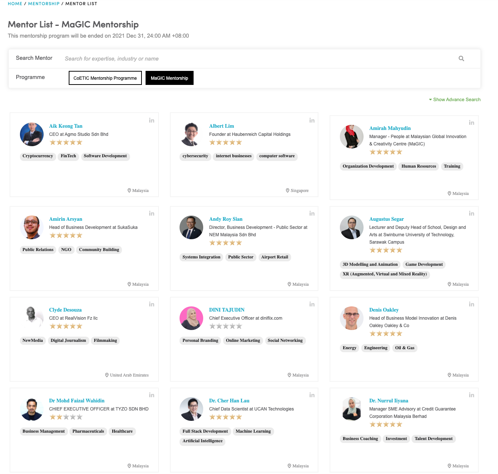

# Running a mentorship program

Program Owners may use existing Central digital infrastructure to embed mentorship into their programs at no extra cost required.


MaGIC mentorship is a Central service collaborating with Futurelab \(a MaGIC alumni startup\). 


Our platform cater the following mentorship format:

* Commitment or ad-hoc basis
* Physical or online meeting
* Open or exclusive programs

#### Commitment basis

Mentor can commit a specific timeslot per week and commit to it. All bookings will be auto accepted by the system on behalf of the mentor. 

#### Ad-Hoc basis

Mentor do not commit to a weekly timeslot. Bookings will be accepted by mentor on case-by-case basis. 

#### Open mentorship program

These are mentorship programs that are open to the public. Anybody with a central member account can participate as a mentee.

#### Exclusive mentorship program

A mentorship program can be set to a close group of users \(through email as identification\). This is suitable for programs like GAP who want to offer dedicated mentors to their participants only. 

