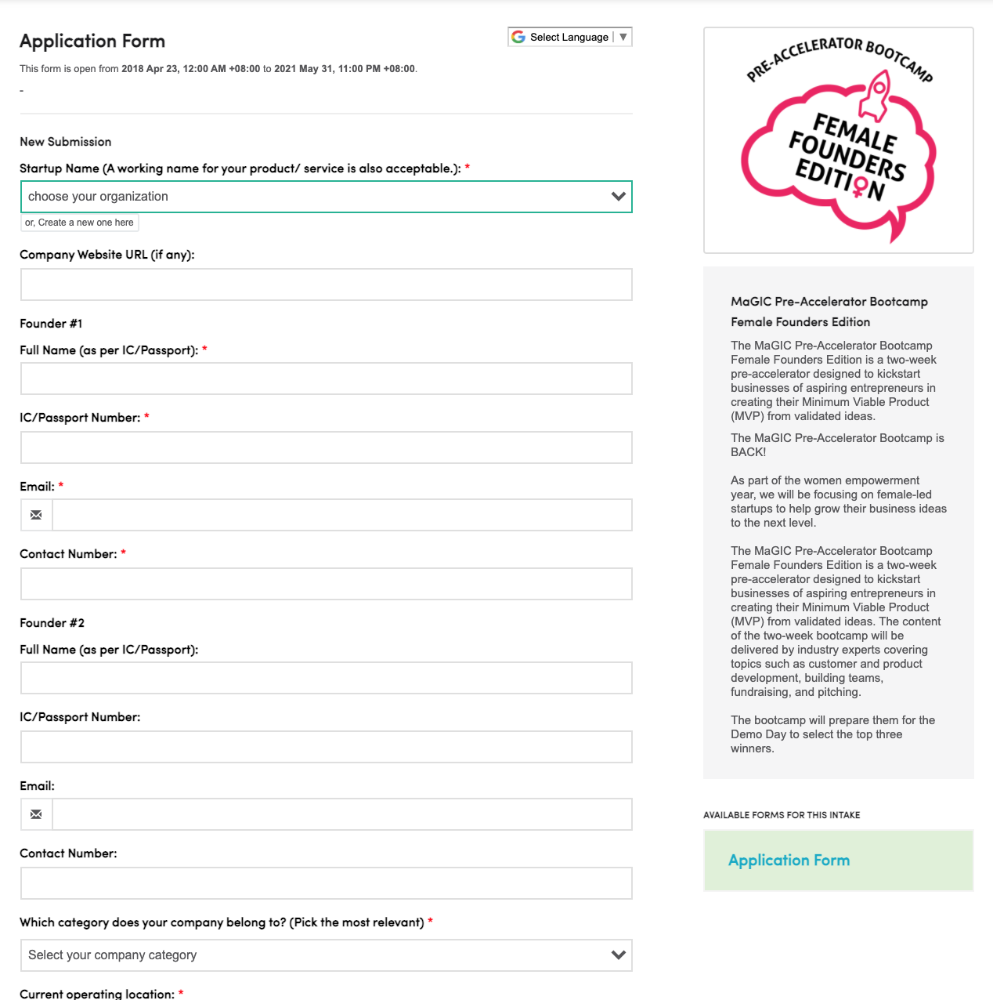

# Running a program

### **F7 Form**

Programs with a selection stage like Bootcamps, University Startup Challenge \(**USC**\), MaGIC Ecosystem Builder Programs \(**MEBP**\), ACE MyStartupHub \(**MSH**\) & Global Market-Fit Program \(**GMP**\) and etc make use of **F7 Form** for the entire process.


F7 is a Google form like CENTRAL module. Developers can create new form quickly in JSON language at a turnaround time of about 3 working days. 

Using F7 has advantages like applicant can reuse their company profile in submission. Entire workflow from application stage to KPI reporting stage can be automated and to comply with SOP.




Accelerators such as Global Accelerator Program \(**GAP**\) will be using the ATAS module. Please read `Running an accelerator`page for details.



### Sync to CENTRAL Event

Data from **F7 Form** sync to **Event** module in CENTRAL for centralized repository and reporting.

