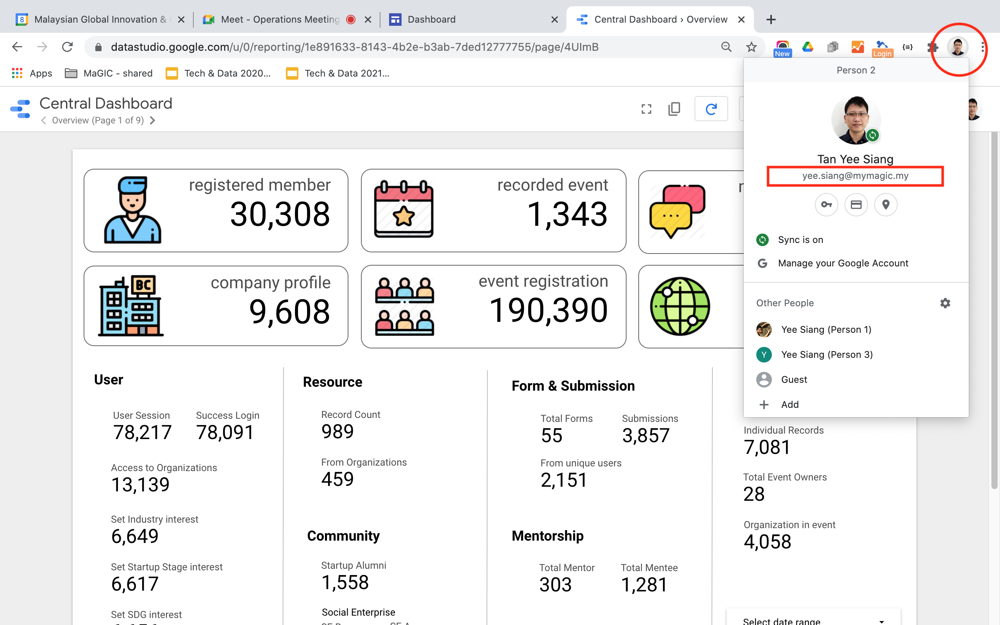

# MaGIC Dashboard

MaGIC Dashboard is developed and maintained by Strategy Team \ Data Unit and all reports are accessible from [https://intranet.mymagic.my](https://intranet.mymagic.my) for all MaGICian internally \(as long as you have a magic email\)

### Google Data Studio

Data displayed are synced in **near real-time** between CENTRAL Database and Google Data Studio. Base on different reporting settings, it can be 1 hr, 4 hrs, 12 hrs or up to 24 hrs.

### Google Chrome browser session

Your Google Chrome browser session must be login with your MaGIC email account as shown in the screenshot below, in order to access MaGIC Dashboard without any issue.

