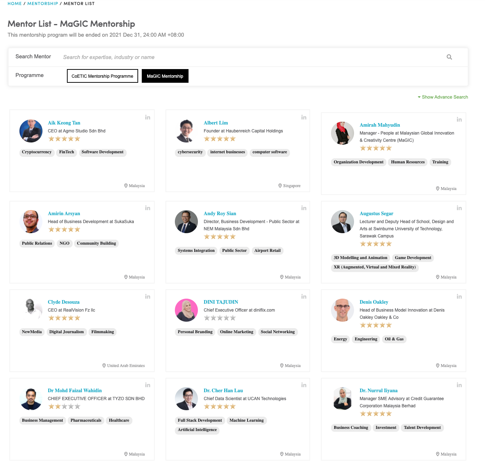

# Running a mentorship program

Program Owner may use exiting Central digital infrastructure to embed mentorship into their programs at no extra cost required.


MaGIC mentorship is a Central service collaborating with Futurelab \(a MaGIC alumni startup\). 


