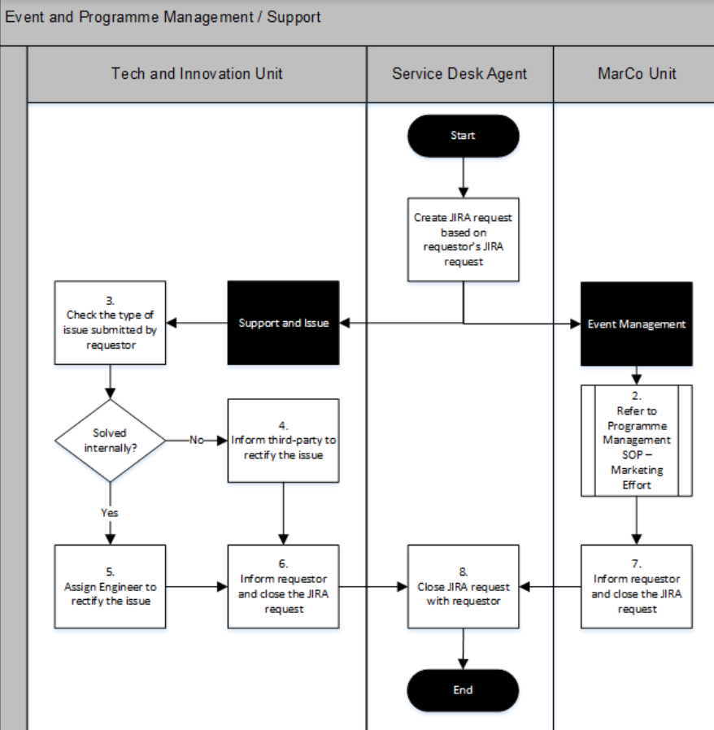
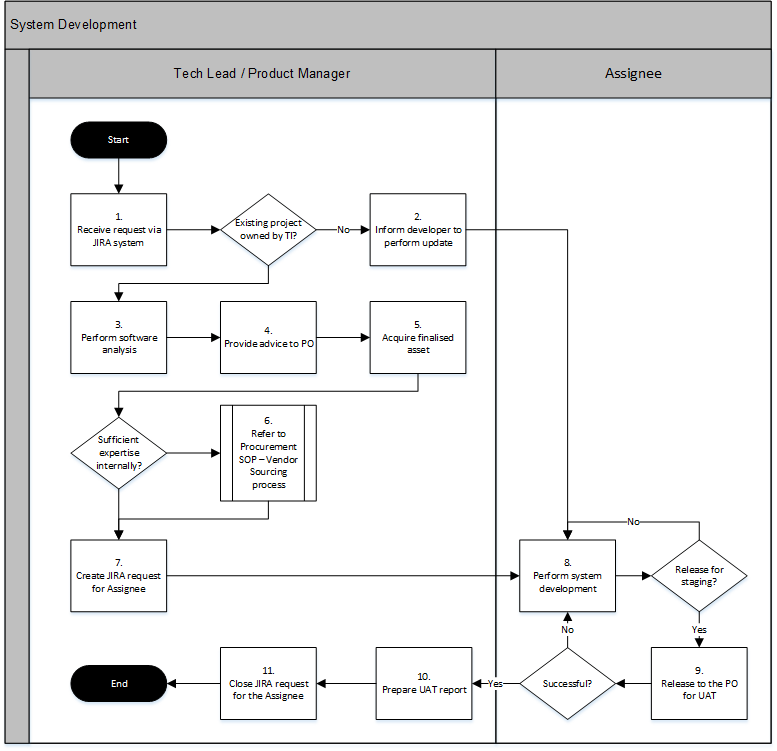

# Submitting Request to Tech team

To handle program owners request better in a more systematic way, we introduced '[Tech Software Request Form](https://docs.google.com/document/d/147kl-tehu3Z3rVUBiNRcJlyVuVGqYcPXulRXyEPkxQE/)'. Please feel free to duplicate this template and fill up to submit to Tech thru JIRA \(preferred\) or Email.

This is also part of our SOP process and requirements from '[SOP Event & Program Management'](https://drive.google.com/file/d/11iDCfN-OZ_CGii43_-A23t8tZQ5axcDI/view?usp=sharing) & '[SOP System Development](https://drive.google.com/file/d/1i34sAP5hJLr5dIL5E__cXeXOI3qFK4bJ/view?usp=sharing)'. \(we are refining these SOP\)


Program Owners are expected to submit this at earlier of the year as soon as possible when their project execution memo is approved.


Take Notes:

* Memo must be approved by CEO and attach as a copy here
* All projects must appoint a person in charge. Tech team appointed project manager will liaise with this personnel only. 
* All project must renew yearly, else allocated resources will automatically discontinued \(e.g. domain name etc\)
* All SLA duration is 6 months with another 6 months extensible.

