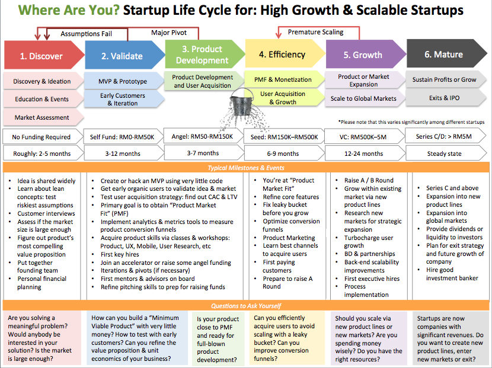

# MaGIC Startup Stages

MaGIC startup stages serves as the foundation for Central system design. 

Events, Resources, Startups, Founders are all linked and tracked using this definition.



> Do you know that different ecosystem has their own set of stages?

* [https://www.startupcommons.org/startup-development-phases.html](https://www.startupcommons.org/startup-development-phases.html)

