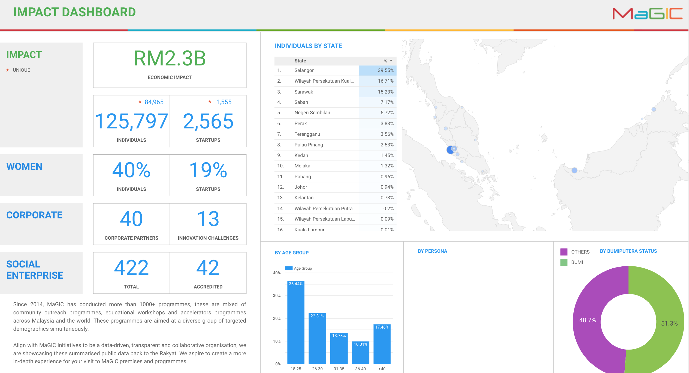
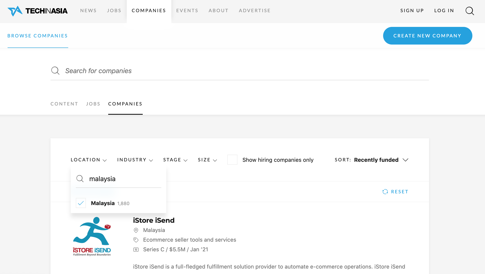
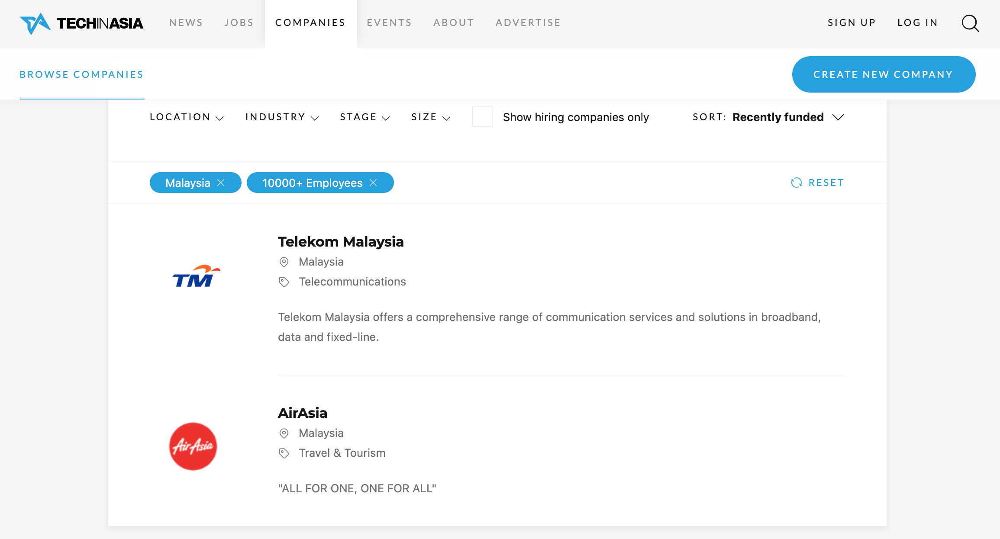
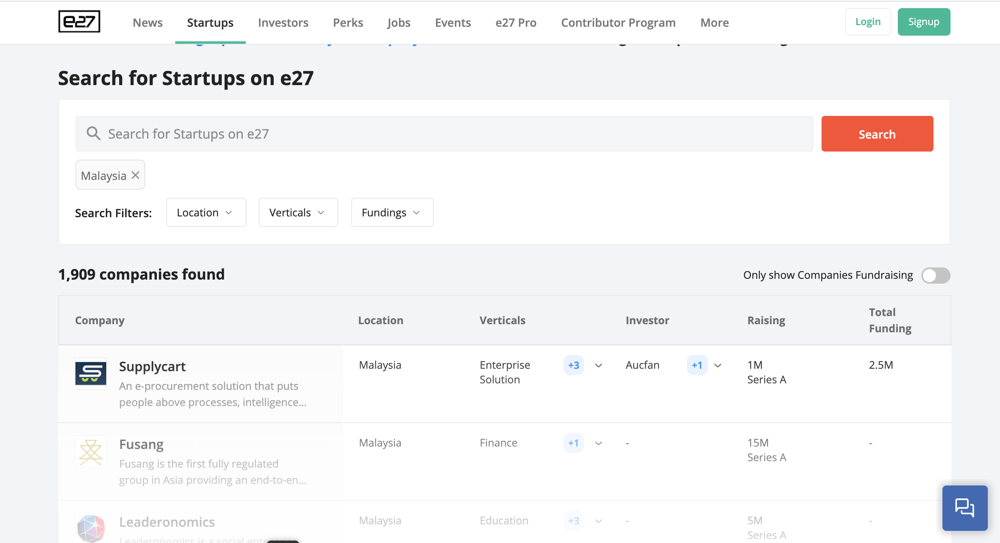

# Number of Startups

We will never have a definite number. One needs to understand that a startup is not a company and not all of them register with SSM. 

It's the same case as to when the same question is thrown to an agency such as TEKUN on how many micro SMEs are there in Malaysia. A good example is that, people may start selling burgers this month but stops in the next month. They can only give numbers based on their funding application while running programs to encourage these micro SME to register.

Hence, to better answer this question, all magician can work together to educate and encourage startups we encounter to form a proper company and proceed to register with SSM.

For the time being,  the standard answer is that we have about 3k startups in Malaysia, our alumni themselves numbers between 1.5 to 2k. Strategy team is the custodian of this number.

### MaGIC Public Impact Dashboard


Public Impact Dashboard providing live data from Central that accessible by the public from URL: [https://datastudio.google.com/u/0/reporting/1DBCItFl7PMujGtfPJjuo336LMhYdQ\_Qp/page/A3L1?s=mISRUN\_djwg](https://datastudio.google.com/u/0/reporting/1DBCItFl7PMujGtfPJjuo336LMhYdQ_Qp/page/A3L1?s=mISRUN_djwg)


### Number from TIA and E27

We periodically check our numbers with database from news site like [TIA](https://www.techinasia.com/companies) & [E27](https://e27.co/startups/).  

